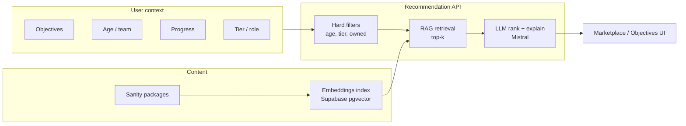

# Coach360 — AI Integration & Recommendations

> **Status:** Architecture reference  
> **Product source:** [`../product/flows.md`](../product/flows.md) Flows 4, 6, 8, 13, 18  
> **Content catalog:** [`content-model.md`](./content-model.md)  
> **Open decisions:** [`../product/stakeholder-questions.md`](../product/stakeholder-questions.md) — Flow 6, D.*  
> **Tech stack:** [`tech-stack.md`](./tech-stack.md)

---

## Overview

AI in Coach360 supports:

1. **Package recommendations** for marketplace purchase (Flow 4)
2. **Objectives loop** — coach sets goals, AI suggests matched content (Flow 6)
3. **Personalization** — adapt drills, content, UX (Flow 6, Pro tier)
4. **Monitoring** — progress and peer engagement feed back into recommendations (Flows 8, 13, 18)

Flow 6 notes: *Would require subscription to AI models and RAG model development.* Planned as **DEP-01** (AI integration, 8 h) and **DEP-02** (RAG, 20 h) in the delivery estimate.

---

## Tier gating

| Feature | Basic | Advanced | Pro |
| --- | --- | --- | --- |
| AI-personalized experience | ✗ | ○ partial | ✓ |
| AI package suggestions | ✗ | ○ partial | ✓ |
| Behavior-based learning | ✗ | ○ partial | ✓ |
| Set objectives (coach) | ✗ | ○ partial | ✓ |

**Conflict to resolve:** Access principles state *“AI features are exclusively available at the Pro tier”* while the matrix shows **○ partial at Advanced**. See Stakeholder Q **6.5**.

Enforce tier gates in the **API** before calling the model, not only in the UI.

---

## Recommendation inputs

Build a server-side **recommendation context** from:

| Source | Parameters | Flow |
| --- | --- | --- |
| Objectives | Player + team goals (shooting, defense, strategy) | 6 |
| Team | Age range | 11 → filters marketplace |
| Progress | Drill completions, weak areas, completion rate | 8, 13 |
| Identity | Role, subscription tier | 2, Part 3 |
| Commerce | Purchase history (exclude owned) | 4 |
| Behavior | Peer engagement patterns (Pro) | 18 |

```typescript
// Illustrative recommendation context
{
  userId: string
  role: 'player' | 'coach' | 'team_manager'
  tier: 'trial' | 'basic' | 'advanced' | 'pro'
  teamId?: string
  teamAgeRange?: { min: number, max: number }
  objectives: { player: string[], team: string[] }
  progress?: {
    completedDrillIds: string[]
    weakAreas?: string[]
    completionRate?: number
  }
  purchaseHistory: string[]
}
```

---

## Do you need RAG?

| Approach | When | MVP fit |
| --- | --- | --- |
| **Metadata filter + sort** | Rich package tags (skills, age, objectives); small catalog | Steel-thread / early Phase 2 |
| **Filter + LLM pick from catalog JSON** | &lt;50 packages, good metadata | Small catalog |
| **Embeddings + vector retrieval (RAG)** | Unstructured content, coach-created packages, semantic matching | Full Flow 6 intent |
| **Behavior learning loop** | Enough progress data to refine over time | Post-MVP |

**Recommendation:** Start with structured filters + metadata; add **RAG (DEP-02)** when the catalog grows or coach-created content needs semantic matching. Delivery risk mitigation: *simple embedding + retrieval first; defer advanced RAG.*

RAG is tied to Flows **6, 4, 12** per DEP-02 (vector store, embeddings, content ingestion).

---

## Architecture



### Layer 1 — Hard filters (always)

- Team age range (hard filter and/or ranking signal — Stakeholder Q 4.5)
- Tier / role eligibility
- Exclude already purchased
- Subscription-gated packages

### Layer 2 — Retrieval (RAG)

1. Ingest marketplace packages from Sanity (title, description, drills, tags, transcripts if available)
2. Embed via Mistral embeddings or dedicated model ([Vercel AI SDK](https://sdk.vercel.ai))
3. Store in **Supabase pgvector**
4. Query with context string built from recommendation inputs
5. Retrieve top 5–10 candidates by similarity

### Layer 3 — LLM re-rank and explain

Send retrieved packages + context to **Mistral** (approved provider per tech stack):

- Re-rank top 3
- Generate human-readable **“why this package”** copy for UI
- Respect business rules (tier, age, not owned)

Use **Vercel AI SDK** so the provider can be swapped without rewriting chat/recommendation logic.

---

## AI use cases (from tech stack)

| Use case | Flow |
| --- | --- |
| Chat support — player/coach Q&A | 5, 6 |
| Package / drill suggestions | 4, 6 |
| Content summarization | 12 |
| Personalization from behavior | 6, 13, 18 |

---

## Data and privacy

- Define what PII and **minor** data may be sent to the AI provider — Stakeholder Q **6.7**
- Admin configures AI parameters and reviews recommendation quality (Flow 7)
- On tier downgrade, preserve AI/objective history but hide until re-upgrade (Flow 17)

---

## Phased delivery

| Phase | Deliverable | Hours (ref) |
| --- | --- | --- |
| 2 | Structured metadata on packages; filter-based suggestions | Flow 4 |
| 3 | Objectives UI + suggestion surface | Flow 6 (24 h) |
| 3–4 | Mistral + simple RAG over catalog | DEP-01 + DEP-02 |
| Post-MVP | Behavior signals from Flows 8, 13, 18 in ranking |

---

## Managed SDKs (delivery recommendation)

Per delivery estimate §10: use managed services to stay within budget — **Stream/Sendbird** (chat), **Stripe** (billing), **Mux** (video). AI via **Mistral + Vercel AI SDK**; vector store on **Supabase pgvector** to avoid extra SaaS for MVP.

---

*Document version: 1.0 · June 2026*
