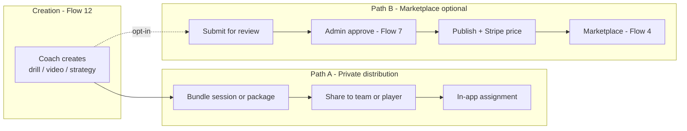

# Coach360 — Content Model & CMS Integration

> **Status:** Architecture reference (derived from flows + discovery analysis)  
> **Product source:** [`../product/flows.md`](../product/flows.md) Flows 3, 4, 7, 12, 14  
> **Open decisions:** [`../product/stakeholder-questions.md`](../product/stakeholder-questions.md) — Flows 3, 4, 7, 12, 14  
> **Tech stack:** [`tech-stack.md`](./tech-stack.md)

---

## Overview

Coach360 has **three content concerns** that must not be conflated:

| Concern | System | Examples |
| --- | --- | --- |
| **Authoring** | Sanity Studio (+ coach mobile upload) | Drills, videos, strategies, package structure |
| **Platform operations** | Admin views in Vite app (Flow 7) | Publish, approve, pricing, drip config, analytics |
| **Transactional state** | Supabase (+ Stripe) | Purchases, drip unlock progress, assignments |

Sanity Studio has **its own UI** for content editors. The admin dashboard governs **marketplace operations** and links to Studio — it does not replace the CMS editor.

---

## Content taxonomy

### Atomic content (leaf items)

| Type | Created by | Flow | Notes |
| --- | --- | --- | --- |
| **Drill** | Coach (Advanced+), Admin | 12 | Written instructions, optional media |
| **Video** | Coach (Advanced+), Admin | 12 | Film, demos; upload pipeline (Mux or storage) |
| **Strategy / Playbook** | Coach (Advanced+), Admin | 12 | Plays, formations; terminology TBD — see Stakeholder Q 12.2 |

### Containers

| Entity | Purpose | Flow | Calendar-bound? | Sellable? |
| --- | --- | --- | --- | --- |
| **Session** | Scheduled practice / event plan | 3, 12 | **Yes** (date, time, recipients) | No |
| **Package** | Reusable bundle of content | 12, 4 | No | Optional (marketplace) |
| **Training program** | Marketplace + drip unit | 4, 14 | No | Yes |

**Proposed hierarchy** (pending stakeholder confirmation on Q 12.1, 14.4):

```
TrainingProgram (marketplace listing)
  └── Module (drip unit, e.g. lessons 1–4)
        └── Lesson
              └── ContentItem (reference: Drill | Video | Strategy)

Session (scheduled event)
  └── ordered list of ContentItem and/or Package references

Package (coach bundle)
  └── ordered list of ContentItem references
```

---

## Upload permissions by role

From the access control matrix ([`../product/flows.md`](../product/flows.md) Part 3):

| Action | Player | Team Manager | Coach | Admin |
| --- | --- | --- | --- | --- |
| Create drills | ✗ | ✗ | ✓ Advanced+ | ✓ |
| Upload video | ✗ | ✗ | ✓ Advanced+ | ✓ |
| Create strategies / playbooks | ✗ | ✗ | ✓ Advanced+ | ✓ |
| Organize into sessions | ✗ | ✗ | ✓ Advanced+ | ✓ |
| Distribute to team / player | ✗ | ✗ (distribute purchased only) | ✓ Advanced+ | ✓ |
| List on marketplace | ✗ | ✗ | **Pending approval** | ✓ |
| Manage marketplace catalog | ✗ | ✗ | ✗ | ✓ |

### Players and team managers

- **Players** do not create training library content. They may share **progress, stats, tips** in chat (Flow 18, Advanced+) — messaging media, not marketplace items.
- **Team managers** purchase and **distribute** team packages; they do not create drills/videos (Flow 12).

---

## Two distribution paths



| Path | Visibility | Marketplace? |
| --- | --- | --- |
| **A — Direct distribution** | Assigned recipients only | No |
| **B — Marketplace listing** | Public catalog (after publish) | Yes |

**Open product decision:** Who may supply Path B — admins only, coaches with approval, or both? See Stakeholder Q **4.1**, **4.2**.

Default workflow for coach → marketplace (recommended):

```
draft → pending_review → approved | rejected → published (boolean)
```

---

## Sanity vs admin dashboard

| Task | Where |
| --- | --- |
| Write descriptions, upload media, structure drills/packages | **Sanity Studio** (`/admin/studio` embedded or separate URL) |
| Approve coach-submitted content | **Admin dashboard** |
| Publish / unpublish marketplace listings | **Admin dashboard** |
| Set Stripe price ID, global drip rules | **Admin dashboard** (may sync fields on Sanity documents) |
| View purchase and completion analytics | **Admin dashboard** (Supabase) |

### Recommended integration

1. **Sanity** — schemas: `drill`, `video`, `strategy`, `trainingPackage`, `module`
2. **Vite admin views** (`src/features/admin/`) — users (Supabase), subscriptions (Stripe), marketplace ops; deployed as web build
3. **Embed Studio** at `/admin/studio` or link to `studio.coach360.com`
4. **Sanity webhook** on publish → Supabase Edge Function (sync metadata, trigger RAG re-index per [`ai-integration.md`](./ai-integration.md))
5. **Capacitor mobile app** — read published content via Sanity CDN/API; auth and purchases via Supabase

### What does NOT live in Sanity

| Data | Store |
| --- | --- |
| User accounts | Supabase Auth |
| Subscription state | Stripe + Supabase |
| Purchase history | Supabase |
| Per-user drip unlock progress | Supabase |
| Chat messages | Supabase Realtime or Stream/Sendbird |
| Session schedule instances | Supabase |

---

## Packaging workflows

### Path A — Library first, then bundle (recommended)

1. Coach creates atomic items (drill, video, strategy)
2. Coach organizes into **package** or attaches to **session**
3. Coach selects recipients → distribute

### Path B — Session from schedule (Flow 3)

1. Coach creates **session** (date, time, type)
2. Coach **adds content** from library and marketplace purchases (Stakeholder Q 3.3 — both; creating new items stays in Flow 12)
3. Assign recipients → notify

### Path C — Marketplace purchase (Flow 4)

1. User browses marketplace → purchases package
2. Content **drips** per schedule (Flow 14)
3. Coach may **redistribute** purchased content to team (Advanced+)

**MVP decision:** Session runtime is calendar-only (Stakeholder Q **3.1** resolved 2026-07-21). No live run-through, timers, or check-ins.

---

## Proposed Sanity document fields (workflow)

```typescript
// trainingPackage (illustrative)
{
  title: string
  description: string
  skills: string[]
  ageRange: { min: number, max: number }
  objectives: string[]
  modules: Reference[]  // drip units
  status: 'draft' | 'pending_review' | 'approved' | 'rejected'
  published: boolean
  createdBy: Reference  // coach profile, if applicable
  stripePriceId?: string
  dripSchedule?: object   // or admin-global config
}
```

---

## App data model evolution

[`../prototype/README.md`](../prototype/README.md) documents the current inline mock data in `src/App.jsx` (user session, store packages, schedule sessions, roster, chat). As backends wire in, data shapes should follow this document and [`../product/flows.md`](../product/flows.md) — the same Vite + Capacitor codebase hardens into production; there is no separate production client stack.

---

## Related dependencies

| ID | Scope | Doc |
| --- | --- | --- |
| DEP-04 | Content management platform (upload, CDN, organize) | [`../delivery/delivery-estimate.md`](../delivery/delivery-estimate.md) |
| DEP-05 | Admin extended (approve, publish) | [`../delivery/delivery-estimate.md`](../delivery/delivery-estimate.md) |

---

*Document version: 1.0 · June 2026*
