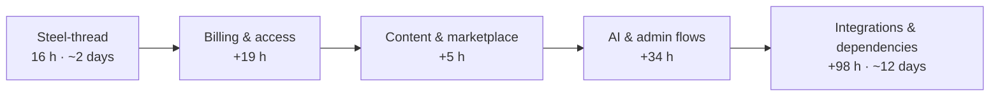

# Coach360 — Delivery Plan & Effort Estimate

> **Audience:** Stakeholders  
> **Documentation index:** [`../README.md`](../README.md)  
> **Scope source:** [`../product/flows.md`](../product/flows.md)  
> **Open questions:** [`../product/stakeholder-questions.md`](../product/stakeholder-questions.md)  
> **Experience estimate source:** `revised_estiamte.docx`  
> **Quick reference:** [Appendix C](#appendix-c--quick-reference-hours) (this document)  
> **Delivery model:** **Sole developer** (full-stack — mobile, backend, integrations)  
> **Date:** June 2026  
> **Unit of measure:** Hours — **74 h** flow estimate (experience-based) + **98 h** flow dependencies (§4.0.4) = **172 h** planning total

---

## At a Glance

Coach360 is a **multi-role mobile coaching platform** defined by **18 user journeys**, **4 roles**, and **4 subscription tiers**. Delivery is planned by **one sole developer** building all layers (mobile, API, integrations).

| Delivery target | Duration (solo @ 8 h/day) | Team | Effort | Purpose |
| --- | --- | --- | ---: | --- |
| **Steel-thread MVP** | **~2 working days** | 1 developer | **16 h** | Prove the core coach → player loop (Flows 1, 3, 5, 8) |
| **Flows only** (experience estimate) | **~9–10 working days** | 1 developer | **74 h** | All 18 user journeys — see §4.0 |
| **Full product** (flows + dependencies) | **~22 working days** | 1 developer | **172 h** | Flows + AI/RAG, Stripe, content mgmt, admin, RBAC — see §4.0.4 |
| **Full product** (benchmark WBS, reference) | **39–54 weeks** @ 8 h/day | 8–10 people equivalent | **~3,200 – 4,300 hours** | Industry benchmark — not the active plan |

The **172-hour plan** (74 h flows + 98 h dependencies) is the active planning baseline. Flow hours cover user journeys; dependencies cover integrations and infrastructure required by flows but not itemised in the journey estimates.

---

## 1. What We Are Building

### 1.1 Product scope (from flows document)

| Dimension | Count |
| --- | --- |
| User journeys | 18 |
| Roles | Player, Coach, Team Manager, Admin |
| Subscription tiers | Trial, Basic, Advanced, Pro |
| Access-control rules | ~223 (role × tier matrix) |
| Core systems | Auth, billing, chat, video, marketplace, drip scheduling, AI, admin |

### 1.2 Complexity profile

Industry benchmarks classify Coach360 as a **complex multi-role SaaS mobile platform** — comparable to subscription marketplaces with real-time messaging and role-based access control. Published effort ranges for similar products: **2,500 – 5,000+ hours** and **10–24 weeks** ([Hitek 2026](https://hitek.com.vn/en/blog-en/app-development-cost-in-2026/), [Cynoteck 2026](https://www.cynoteck.com/blog-post/mobile-app-development-cost), [Omega Solution 2026](https://solution.omega.ac/mvp-development-cost/)).

Our prior benchmark-based estimate (**~4,320 hours** at mid complexity) falls within that range — but is **not the active plan**.

The **experience-based flow estimate** (see §4.0) totals **74 engineering hours** across all 18 user journeys. **Flow dependencies totalling 98 hours** (§4.0.4) cover AI/RAG, Stripe billing, content management, extended admin, and other infrastructure required by the flows — bringing the **planning total to 172 hours**. At **8 hours per day**, one sole developer delivers the full product in approximately **22 working days**.

---

## 2. Delivery Strategy — Phased by Flow



| Phase | What ships | Flows / dependencies | Hours (incremental) | Hours (cumulative) | Calendar (solo @ 8 h/day) |
| --- | --- | --- | ---: | ---: | --- |
| **0 — Steel-thread** | Sign up, schedule, chat, player session view | 1, 3, 5, 8 | 16 | 16 | ~2 days |
| **1 — Billing & access** | Subscriptions, trial expiry, paywall | 2, 9, 10, 17 + DEP-03 | 19 + 12 | 47 | ~6 days |
| **2 — Content & marketplace** | Marketplace, dripping, content creation | 4, 12, 14 + DEP-04 | 5 + 12 | 64 | ~8 days |
| **3 — AI & admin flows** | AI engine, objectives, admin UI | 6, 7 | 34 | 98 | ~12 days |
| **4 — Flow dependencies** | RAG, AI integration, admin ops, RBAC, DevOps | DEP-01–02, 05–09 | 74 | **172** | **~22 days** |

*Phase hours show flow estimate first; dependency items (DEP-xx) from §4.0.4 are applied in the phase where they are built. Flows 11, 13, 15, 16, 18 are covered within flow hours via Part 1 attribution.*

---

## 3. Steel-Thread MVP — First Deliverable

### 3.1 Objective

Deliver a **demonstrable, end-to-end product slice** that validates the Coach360 concept — not a mock prototype. One complete path: **sign up → schedule a session → view content → message coach**.

### 3.2 Developer & capacity

| Role | Headcount | Hours |
| --- | ---: | ---: |
| Sole developer (full-stack) | 1 | 16 |
| **Total** | **1** | **16** |

*At 8 h/day this is ~2 working days. At 4 h/day (part-time) it is ~4 calendar days.*

### 3.3 Steel-thread scope — included

| Area | Deliverable | Flow | Hours |
| --- | --- | ---: | ---: |
| **Auth & onboarding** | Email sign-up, role selection, basic profile | 1 | 4 |
| **Teams** | Create team, invite link, player joins roster | 11 → 1 | (in 4) |
| **Schedule** | Coach creates session; player views session details | 3 | 3 |
| **Player experience** | View session, complete drills, track progress | 8 | 4 |
| **Progress & feedback** | Drill logging, coach feedback loop | 13 → 8 | (in 4) |
| **Chat** | 1-on-1 coach ↔ player messaging via managed SDK | 5 | 5 |
| **Steel-thread total** | | | **16** |

### 3.4 Steel-thread scope — explicitly deferred

| Deferred capability | Target phase | Flows | Hours |
| --- | --- | --- | ---: |
| Subscriptions, trial, paywall, upgrade/downgrade | Phase 1 | 2, 9, 10, 17 | 19 |
| Marketplace, content creation, drip unlock | Phase 2 | 4, 12, 14 | 5 |
| First-time guided onboarding (coach & player) | Phase 2 | 15, 16 | (in Phases 0–2) |
| Player-to-player sharing | Phase 2 | 18 | (in Flow 5 / 8) |
| AI recommendations and objectives | Phase 3 (+ dependencies) | 6, DEP-01, DEP-02 | 24 + 28 |
| Admin control plane | Phase 3 (+ dependencies) | 7, DEP-05 | 10 + 8 |
| Stripe billing for gated content | Phase 1 | DEP-03 | 12 |
| Content management (upload, CDN, organize) | Phase 2 | DEP-04 | 12 |
| RBAC + tier feature gating | Phase 4 | DEP-06 | 16 |
| Push notifications, DevOps, integration testing | Phase 4 | DEP-07, 08, 09 | 22 |

### 3.5 Steel-thread success criteria

- [ ] A coach can sign up, create a team, and schedule a session with content attached
- [ ] A player can join via invite link, view the session, and complete the onboarding flow
- [ ] Coach and player can exchange messages in real time
- [ ] App runs on target mobile platform(s) with stable auth and data persistence
- [ ] Demo-ready for stakeholder review after Phase 0 (~16 h)

---

## 4. Full Product — Effort Estimate

### 4.0 Experience-based estimate — flows only

> **Source:** [`revised_estiamte.docx`](./revised_estiamte.docx)  
> **Basis:** Actual delivery experience against the 18 user journeys  
> **Developer:** Sole developer (full-stack)  
> **Flow subtotal:** 74 h — user-journey scope only; see §4.0.4 for flow dependencies

#### All 18 flows — hours estimate

Each flow is surfaced with its hour line. Flows with **direct** estimates are billable line items. Flows marked **included** add no incremental hours — their scope sits inside the direct estimate of the mapped Part 1 flow (see §4.0.1).

| Flow | Name | Hours | Estimate type | Verbatim line (revised doc) |
| ---: | --- | ---: | --- | --- |
| 1 | User Onboarding & Profile Creation | **4** | Direct | `User Onboarding & Profile Creation – 4 Hours` |
| 2 | Subscription & Trial Flow | **15** | Direct | `Subscription & Trial Flow – Rough Estimate 15 Hours` |
| 3 | Coach Planning & Scheduling | **3** | Direct | `Coach Planning & Scheduling – 3 Hours` |
| 4 | Marketplace & Content Dripping | **5** | Direct | `Marketplace & Content Dripping – 5 hours` |
| 5 | Chat & Communication | **5** | Direct | `Chat & Communication – 5 Hours` |
| 6 | AI Engine & Objectives | **24** | Direct | `AI Engine & Objectives – 24 Hours` |
| 7 | Admin Interface | **10** | Direct | `Admin Interface – 10 Hours` |
| 8 | Player Experience (End-to-End) | **4** | Direct | `Player Experience (End-to-End) – 4 Hours` |
| 9 | Trial Expiration & Conversion | **2** | Direct | `Trial Expiration & Conversion – 2 Hours` |
| 10 | Content Paywall Encounter | **2** | Direct | `Content Paywall Encounter – 2 Hours` |
| 11 | Team Setup & Roster Management | **—** | Included → Flow 1 | `Covered Hours in the previous flows estimate` |
| 12 | Coach Content Creation & Distribution | **—** | Included → Flow 4 | `Covered in Previous Flows Estimate` |
| 13 | Player Progress & Coach Feedback Loop | **—** | Included → Flow 8 | `Included in previous flows estimate` |
| 14 | Drip Content Unlock Experience | **—** | Included → Flow 4 | `Included in previous flows estimate` |
| 15 | First-Time Coach Onboarding | **—** | Included → Flows 1, 3, 4 | `Included in other flows estimate` |
| 16 | First-Time Player Onboarding | **—** | Included → Flows 1, 4, 8 | `Included in other flows estimate` |
| 17 | Subscription Upgrade & Downgrade | **—** | Included → Flow 2 | `Included in other flows estimate` |
| 18 | Player-to-Player Knowledge Sharing | **—** | Included → Flows 5, 8 | `Included in other flows estimate` |
| | **Unique engineering total** | **74** | 10 direct + 8 included | |

#### Part 1 / Part 2 subtotals

| Group | Direct-hour flows | Subtotal |
| --- | --- | ---: |
| Part 1 — Core User Journeys (Flows 1–8) | 1–8 | **70** |
| Part 2 — Additional Journeys (Flows 9–10) | 9–10 | **4** |
| Part 2 — Included journeys (Flows 11–18) | — | **0** (scope in Part 1) |
| **Total** | | **74** |

#### Solo-developer calendar (flows only)

| Pace | Hours/week | Flows only (74 h) | Full plan (172 h) | Steel-thread (16 h) |
| --- | ---: | --- | --- | --- |
| Full-time | 40 (8 h/day) | **~9–10 working days** | **~22 working days** | **~2 days** |
| Part-time | 20 (4 h/day) | **~3.5–4 weeks** | **~8 weeks** | **~4 days** |
| Part-time | 10 (2 h/day) | **~7–8 weeks** | **~16 weeks** | **~8 days** |

#### 4.0.1 Part 1 → Part 2 flow mapping (content cross-walk)

Part 2 flows 11–18 carry **no separate hour line** in the revised estimate. The table below maps each Part 2 flow to the Part 1 flow whose hours cover it. Mappings for Flows 11–13 are **confirmed by stakeholder**.

| Part 2 flow | Part 2 name | Verbatim estimate line | Mapped Part 1 flow | Mapping basis | Confidence |
| ---: | --- | --- | ---: | --- | --- |
| 9 | Trial Expiration & Conversion | `Trial Expiration & Conversion – 2 Hours` | 2 | Trial lifecycle is the downstream branch of Flow 2 | **Explicit** — separate 2 h line item |
| 10 | Content Paywall Encounter | `Content Paywall Encounter – 2 Hours` | 2 | Tier-gated feature access is defined in Flow 2 | **Explicit** — separate 2 h line item |
| 11 | Team Setup & Roster Management | `Covered Hours in the previous flows estimate` | **1** | Team setup and roster are part of onboarding (Team Manager role, profile, roster) | **Confirmed** |
| 12 | Coach Content Creation & Distribution | `Covered in Previous Flows Estimate` | **4** | Content creation, packages, distribution, and video upload sit in marketplace & dripping scope | **Confirmed** |
| 13 | Player Progress & Coach Feedback Loop | `Included in previous flows estimate` | **8** | Player drill completion, progress tracking, and coach feedback loop are the player end-to-end journey | **Confirmed** |
| 14 | Drip Content Unlock Experience | `Included in previous flows estimate` | 4 | Flow 4: *Content Drips Over Time* and *Track Completion* | High |
| 15 | First-Time Coach Onboarding | `Included in other flows estimate` | 1, 3, 4 | Guided steps: profile (1), first session (3), marketplace browse (4) | High |
| 16 | First-Time Player Onboarding | `Included in other flows estimate` | 1, 4, 8 | Guided steps: profile (1), browse content (4), first drill and progress (8) | High |
| 17 | Subscription Upgrade & Downgrade | `Included in other flows estimate` | 2 | Account settings tier change is an extension of Flow 2 | High |
| 18 | Player-to-Player Knowledge Sharing | `Included in other flows estimate` | 5, 8 | Flow 5: *Player-to-Player* channel; Flow 8: *Share with Peers* | High |

**Reverse view — Part 1 flows and the Part 2 journeys they cover:**

| Part 1 flow | Part 1 name | Hours | Part 2 flows covered | Verbatim Part 2 status |
| ---: | --- | ---: | ---: | --- |
| 1 | User Onboarding & Profile Creation | 4 | 11, 15, 16 | Flow 11: `Covered Hours in the previous flows estimate`; Flows 15–16: `Included in other flows estimate` |
| 2 | Subscription & Trial Flow | 15 | 9, 10, 17 | Flows 9–10: explicit 2 h each; Flow 17: `Included in other flows estimate` |
| 3 | Coach Planning & Scheduling | 3 | 15 | Flow 15: `Included in other flows estimate` |
| 4 | Marketplace & Content Dripping | 5 | 12, 14, 15, 16 | Flow 12: `Covered in Previous Flows Estimate`; Flow 14: `Included in previous flows estimate`; Flows 15–16: `Included in other flows estimate` |
| 5 | Chat & Communication | 5 | 18 | Flow 18: `Included in other flows estimate` |
| 6 | AI Engine & Objectives | 24 | — | — |
| 7 | Admin Interface | 10 | — | Resolves Flow 4 open question on marketplace curation (see §4.0.3) |
| 8 | Player Experience (End-to-End) | 4 | 13, 16, 18 | Flow 13: `Included in previous flows estimate`; Flows 16, 18: `Included in other flows estimate` |

#### 4.0.2 Flow 2 tier breakdown (from revised estimate)

Flow 2’s 15-hour *Rough Estimate* includes the following per-tier line items. Parenthetical notes are reproduced verbatim from the revised document.

| Tier | Line item | Hours / note (verbatim) |
| --- | --- | --- |
| Basic | Profile setup | `1 Hour` |
| Basic | Purchase content | `(1 Hours. dependent, Content Management)` |
| Basic | Track own progress | `(what progress?)` |
| Advanced | Coach & communicate | `(Need more Info)` |
| Advanced | Distribute content | `(Need more Info)` |
| Advanced | Plan & schedule | `(Need more Info)` |
| Pro | AI personalization | — |
| Pro | Set objectives | `(Need more Info)` |
| Pro | Full MVP access | `(Need more Info)` |

#### 4.0.3 Notes analysis — italic text and parenthetical comments

The revised estimate adds clarifying notes (italic prose) and open questions (parentheses). Impact on planning:

| Location | Note (verbatim or paraphrased) | Type | Planning impact |
| --- | --- | --- | --- |
| Flow 1 | *Coaches and players can operate independently without a team… Team managers must set up a team… Admin accounts are provisioned through the backend…* | Italic — scope rule | Confirms Flow 11 team setup is **required** for Team Manager but **optional** for Coach/Player; admin is backend-only (Flow 7), not self-signup |
| Flow 2 — Basic | `(what progress?)` | Parenthetical — open question | **Scope gap:** “Track own progress” at Basic tier is undefined — likely Flow 8 / Flow 13; needs product definition before estimating |
| Flow 2 — Basic | `(1 Hours. dependent, Content Management)` | Parenthetical — dependency | Addressed in dependency DEP-04 (content management platform) — separate from Flow 4's 5 h marketplace UI |
| Flow 2 — Advanced | `(Need more Info)` × 3 | Parenthetical — open question | Coach & communicate, distribute content, plan & schedule at Advanced tier need feature boundaries — maps to Flows 3, 5, 12 |
| Flow 2 — Pro | `(Need more Info)` × 2 | Parenthetical — open question | Set objectives and Full MVP access are undefined — maps to Flow 6 and overall tier matrix |
| Flow 3 | *…(Need more information, what happens during sessions? How do we schedule sessions?)* | Italic + parenthetical | **Scope gap:** session **runtime** behaviour (in-session vs calendar-only) is undefined; may add hours beyond the 3 h estimate |
| Flow 4 intro | *Should we have a content contributor which content, users will buy? Who determines the packages? – Refer to Flow 7* | Italic — open question | **Product decision:** marketplace supply model (coach-created vs admin-curated) deferred to Flow 7 admin; affects Flows 4, 12, and 7 estimates |
| Flow 6 | *Would require subscription to AI models and RAG Model development.* | Italic — technical dependency | Addressed in dependencies DEP-01 (AI integration) and DEP-02 (RAG) — separate from Flow 6's 24 h UI/loop estimate |
| Flow 9 | *Users who do not subscribe… retain a Basic-level profile…* | Italic — business rule | Confirms post-trial downgrade behaviour; included in Flow 9’s explicit 2 h |
| Flow 10 | *The paywall screen clearly communicates… Trial option is only shown if…* | Italic — UX rule | Trial-on-paywall logic is a distinct branch; included in Flow 10’s explicit 2 h |
| Flow 11 | *Players can be invited via a shareable link… Team age ranges filter marketplace…* | Italic — scope rule | Invite mechanics in Flow 11; marketplace filtering links Flow 11 → Flow 4 |
| Flow 12 | *Content can include video uploads… bundle multiple items…* | Italic — scope rule | **Confirmed:** Flow 12 maps to Flow 4 (5 h) — video upload is in scope for marketplace & content dripping |
| Flow 13 | *The AI engine also monitors this loop…* | Italic — integration | **Confirmed:** Flow 13 maps to Flow 8 (4 h); AI monitoring (Flow 6) is a separate 24 h line item |
| Flow 14 | *Drip schedules can vary by package… higher subscription tiers…* | Italic — business rule | Tier-dependent drip speed is a configuration surface; covered under Flow 4’s 5 h |
| Flow 15 | *Team creation and player invites can be done later… without a team.* | Italic — scope rule | Confirms Flow 15 is a **guided subset** of Flows 1, 3, 4 — not a separate build |
| Flow 16 | *Players can join a team at any time… Independent players have full access…* | Italic — scope rule | Confirms Flow 16 is a **guided subset** of Flows 1, 4, 8 |
| Flow 17 | *Upgrades take effect immediately… Data from higher-tier features… preserved but inaccessible…* | Italic — business rule | Proration and data-retention rules affect billing integration scope (Flow 2 + Flow 17) |
| Flow 18 | *Player-to-player sharing is available at Advanced tier… AI engine monitors peer engagement…* | Italic — tier + integration | Tier gate at Advanced; AI monitoring links Flow 18 → Flow 6 |

**Summary of open items requiring product input:**

1. What does “track own progress” mean at Basic tier? (Flow 2)
2. What happens **during** a scheduled session vs at scheduling time? (Flow 3)
3. Who creates marketplace packages — coaches, admins, or both? (Flow 4 → Flow 7)
4. What is included in “Full MVP access” at Pro tier? (Flow 2)

*Items previously flagged (RAG scope, content management, Stripe gating) are now covered in §4.0.4 dependencies.*

#### 4.0.4 Flow dependencies — required by flows, not itemised in journey estimates

The 74-hour flow estimate covers **user-journey screens and logic**. The items below are **dependencies** — infrastructure and integration work that flows reference but do not itemise. Dependency hours are additive on top of the flow subtotal.

| ID | Work package | Hours | Related flows | What it covers |
| --- | --- | ---: | --- | --- |
| DEP-01 | **AI model integration** | **8** | 6 | Provider APIs (OpenAI / Anthropic / etc.), orchestration layer, prompt management, cost/config — beyond Flow 6's UI loop |
| DEP-02 | **RAG development** | **20** | 6, 4, 12 | Vector store, embeddings pipeline, content ingestion, retrieval-augmented recommendations — per Flow 6 note |
| DEP-03 | **Stripe integration for gated content** | **12** | 2, 9, 10, 17 | Production billing: webhooks, subscription sync, tier enforcement on features and content, proration/downgrade |
| DEP-04 | **Content management platform** | **12** | 4, 12, 14 | Upload pipeline, video/CDN (Mux or similar), organize drills/packages, coach-created vs admin-curated content |
| DEP-05 | **Admin management (extended)** | **8** | 7 | User suspend/reactivate, marketplace publish/approve, subscription overrides, analytics — beyond Flow 7's 10 h dashboard |
| DEP-06 | **RBAC + tier feature gating** | **16** | Part 3 | Role × tier enforcement in code (not the full 223-rule matrix — that remains post-MVP expansion) |
| DEP-07 | **Push notifications** | **4** | 3, 5, 8, 14 | Cross-cutting notification service for scheduling, chat, drip unlock |
| DEP-08 | **DevOps, CI/CD, deployment** | **8** | All | Build pipeline, environment config, app store / TestFlight prep |
| DEP-09 | **Integration testing & rework** | **10** | All | Solo QA across flows, cross-system integration fixes, edge-case rework |
| | **Dependencies subtotal** | **98** | | |
| | **Flow subtotal** | **74** | §4.0 | 18 user journeys |
| | **Planning total** | **172** | | Flows + dependencies |

##### Dependency allocation by delivery phase

| Phase | Dependencies built | Hours |
| --- | --- | ---: |
| 1 — Billing & access | DEP-03 (Stripe) | 12 |
| 2 — Content & marketplace | DEP-04 (content management) | 12 |
| 3 — AI & admin flows | DEP-01 (AI integration), DEP-02 (RAG), DEP-05 (admin extended) | 36 |
| 4 — Cross-cutting | DEP-06 (RBAC), DEP-07 (push), DEP-08 (DevOps), DEP-09 (testing) | 38 |
| | **Dependencies total** | **98** |

##### Planning total calendar (sole developer)

| Component | Hours | Calendar @ 8 h/day |
| --- | ---: | --- |
| Flow estimates (18 journeys) | 74 | ~9–10 days |
| Flow dependencies | 98 | ~12 days |
| **Planning total** | **172** | **~22 working days** |

---

### 4.1 Benchmark work-breakdown summary (reference — multi-team estimate)

Hours below are **engineering hours** from industry benchmarks. Project totals add **20% QA** and **15% PM** (industry standard per [Techsy 2026](https://techsy.io/en/resources/tools/mobile-app-cost-calculator), [Hypersense 2025](https://hypersense-software.com/blog/2025/07/19/software-development-effort-allocation-dev-qa-design-pm-ratio/)).

| ID | Work package | Flows | Low | Mid | High |
| --- | --- | --- | ---: | ---: | ---: |
| WP-00 | Discovery, architecture, wireframes | All | 80 | 120 | 160 |
| WP-01 | Mobile shell, 6-tab nav, design system | — | 100 | 140 | 180 |
| WP-02 | Authentication | 1 | 40 | 80 | 120 |
| WP-03 | Multi-role onboarding (Coach, Player, Team Manager) | 1, 15, 16 | 96 | 140 | 200 |
| WP-04 | RBAC + tier feature gating (~223 rules) | Part 3 | 120 | 200 | 280 |
| WP-05 | Subscriptions, trial, upgrade/downgrade | 2, 9, 17 | 80 | 120 | 160 |
| WP-06 | Paywall screens | 10 | 32 | 48 | 64 |
| WP-07 | Team setup, roster, invites | 11 | 80 | 120 | 160 |
| WP-08 | Session scheduling + notifications | 3, 8 | 80 | 140 | 200 |
| WP-09 | Content creation (drills, articles, playbooks) | 12 | 100 | 160 | 220 |
| WP-10 | Video upload, transcode, CDN playback | 4, 12 | 80 | 120 | 160 |
| WP-11 | Marketplace browse, purchase, distribute | 4 | 120 | 180 | 240 |
| WP-12 | Drip content unlock scheduler | 14 | 40 | 64 | 96 |
| WP-13 | Real-time chat (team, DM, P2P + media) | 5, 18 | 160 | 280 | 400 |
| WP-14 | Push notifications | 3, 5, 8, 14 | 32 | 56 | 80 |
| WP-15 | Player progress, 6-tab profile, drill logging | 8, 13 | 120 | 180 | 240 |
| WP-16 | Objectives (player + team) | 6 | 64 | 100 | 140 |
| WP-17 | AI recommendations + personalization | 6 | 120 | 200 | 320 |
| WP-18 | Admin control plane | 7 | 160 | 240 | 320 |
| WP-19 | Backend API, database, multi-tenant model | All | 200 | 300 | 400 |
| WP-20 | DevOps, CI/CD, app store deployment | All | 48 | 80 | 120 |
| | **Engineering subtotal** | | **1,992** | **3,132** | **4,356** |

### 4.2 Benchmark project totals (engineering + QA + PM)

| Scenario | Engineering | QA (20%) | PM (15%) | **Project total** |
| --- | ---: | ---: | ---: | ---: |
| Low | 1,992 | 398 | 299 | **2,689** |
| **Mid (planning figure)** | **3,132** | **626** | **470** | **4,322** |
| High | 4,356 | 871 | 653 | **6,011** |

### 4.3 Benchmark cross-check

| External benchmark | Published range | Coach360 mid |
| --- | --- | --- |
| Hitek — complex application | 1,500 – 3,000 h | Slightly above (admin + AI + 223 rules justify delta) |
| Cynoteck — complex app | 2,500 – 5,000+ h | Within range |
| Omega — Tier 3 SaaS | 16 – 24 weeks @ 6 FTE | 3,840 – 5,760 h | Within range |

---

## 5. Phased Roadmap (Sole Developer)

Assumes **1 developer**, flow hours (§4.0) + flow dependencies (§4.0.4), sequential delivery.

| Phase | Duration @ 8 h/day | Incremental hours | Cumulative hours | Key deliverables |
| --- | --- | ---: | ---: | --- |
| **0 — Steel-thread** | ~2 days | 16 | 16 | Flows 1, 3, 5, 8 (+ 11, 13 via attribution) |
| **1 — Billing & access** | ~4 days | 31 | 47 | Flows 2, 9, 10, 17 + Stripe (DEP-03) |
| **2 — Content & marketplace** | ~2 days | 17 | 64 | Flow 4 (+ 12, 14, 15, 16, 18) + content mgmt (DEP-04) |
| **3 — AI & admin flows** | ~4 days | 34 | 98 | Flows 6, 7 |
| **4 — Flow dependencies** | ~9 days | 74 | **172** | AI integration, RAG, admin ops, RBAC, push, DevOps, testing (DEP-01, 02, 05–09) |

**Total calendar from kickoff:** **~22 working days** full-time, or **~8 weeks** at 20 h/week.

### Phase 0 detail — Steel-thread (16 h)

| Flow | Name | Hours |
| ---: | --- | ---: |
| 1 | User Onboarding & Profile Creation (+ Flow 11) | 4 |
| 3 | Coach Planning & Scheduling | 3 |
| 5 | Chat & Communication | 5 |
| 8 | Player Experience (+ Flow 13) | 4 |
| | **Phase 0 total** | **16** |

### Phase 1 detail — Billing & access (+31 h)

| Item | Name | Hours |
| --- | --- | ---: |
| Flow 2 | Subscription & Trial Flow (+ Flow 17) | 15 |
| Flow 9 | Trial Expiration & Conversion | 2 |
| Flow 10 | Content Paywall Encounter | 2 |
| DEP-03 | Stripe integration for gated content | 12 |
| | **Phase 1 total** | **31** |

### Phase 2 detail — Content & marketplace (+17 h)

| Item | Name | Hours |
| --- | --- | ---: |
| Flow 4 | Marketplace & Content Dripping (+ Flows 12, 14, 15, 16, 18) | 5 |
| DEP-04 | Content management platform | 12 |
| | **Phase 2 total** | **17** |

### Phase 3 detail — AI & admin flows (+34 h)

| Flow | Name | Hours |
| ---: | --- | ---: |
| 6 | AI Engine & Objectives | 24 |
| 7 | Admin Interface | 10 |
| | **Phase 3 total** | **34** |

### Phase 4 detail — Flow dependencies (+74 h)

| ID | Name | Hours |
| --- | --- | ---: |
| DEP-01 | AI model integration | 8 |
| DEP-02 | RAG development | 20 |
| DEP-05 | Admin management (extended) | 8 |
| DEP-06 | RBAC + tier feature gating | 16 |
| DEP-07 | Push notifications | 4 |
| DEP-08 | DevOps, CI/CD, deployment | 8 |
| DEP-09 | Integration testing & rework | 10 |
| | **Phase 4 total** | **74** |

*Note: DEP-03 and DEP-04 are built in Phases 1–2. Phase 4 cumulative total = 172 h.*

---

## 6. Team Composition

### 6.1 Active plan — sole developer

| Role | Count | Responsibility |
| ---: | ---: | --- |
| Sole developer | 1 | Mobile app, backend API, database, SDK integrations (chat, billing, video), AI/RAG, admin panel, deployment |

*No separate QA, design, or PM roles — testing, UX, and scope management are absorbed by the developer. AI-assisted development (Cursor / Claude Code) is assumed to offset the lack of a dedicated team (see §7).*

### 6.2 Reference — prior multi-person estimate (not active)

The tables below reflect the original 8-person benchmark plan. Retained for comparison only.

**Steel-thread sprint (original 15-day plan)**

| Role | Count | Responsibility |
| ---: | ---: | --- |
| Mobile developer | 3 | UI, navigation, client integrations |
| Backend engineer | 2 | API, database, auth, chat SDK |
| QA engineer | 1 | Critical-path testing |
| UI/UX designer | 1 | Wireframes, component polish |
| Project manager | 1 | Scope lock, daily standups, stakeholder updates |

**Full product (original Phases 1–3)**

| Role | Count | Duration |
| ---: | ---: | --- |
| Tech lead / architect | 1 | Full programme |
| Mobile developer | 2 | Full programme |
| Backend engineer | 2 | Full programme |
| AI engineer | 0.5 | Phase 3 |
| QA engineer | 1 | Phases 1–3 |
| UI/UX designer | 1 | Phases 1–2 |
| Project manager | 1 | Full programme |

---

## 7. AI-Assisted Development (Sole Developer)

As the **sole developer**, AI-assisted / agentic development (Claude Code, Cursor agents) is not optional — it substitutes for missing QA, design, and backend teammates. With [`../product/flows.md`](../product/flows.md) as the living spec, the 74-hour experience estimate is achievable in ~9–10 working days.

### 7.1 Research summary

| Source | Finding |
| --- | --- |
| [Enterprise RCT (arXiv 2026)](https://arxiv.org/html/2410.12944v3) | 21–26% faster in real enterprise settings |
| [Talk Think Do Q1 2026](https://talkthinkdo.com/ai-velocity-report/q1-2026/) | 40–50% faster on AI-native greenfield projects |
| [METR Jul 2025](https://metr.org/blog/2025-07-10-early-2025-ai-experienced-os-dev-study/) | 19% slower on familiar legacy codebases — mitigated by greenfield backend |
| [Span AI Impact 2026](https://www.span.app/blog/introducing-ai-impact-report) | +30% rework on AI-generated PRs → QA hours rise |

Coach360 is well-suited to AI-assisted solo delivery: detailed flows doc, existing UI prototype, CRUD-heavy surfaces, managed SDK integrations.

### 7.2 Impact on planning total

| Component | Hours | Calendar (solo @ 8 h/day) |
| --- | ---: | --- |
| Flow estimates (18 journeys) | 74 | ~9–10 days |
| Flow dependencies (§4.0.4) | 98 | ~12 days |
| **Planning total** | **172** | **~22 working days** |
| Benchmark WBS (reference only) | 4,322 | ~54 weeks solo |

### 7.3 Prerequisites for AI-assisted solo delivery

1. [`../product/flows.md`](../product/flows.md) committed as immutable spec before coding
2. Greenfield backend (not patching legacy spaghetti)
3. Managed SDKs for chat, billing, video (Stream, RevenueCat, Mux)
4. Tests generated alongside features from day one
5. Human architecture and integration review gates maintained

---

## 8. Flow Coverage Matrix

Per-flow hours and delivery phase for the sole-developer plan.

| Flow | Name | Hours | Phase 0 | Phase 1 | Phase 2 | Phase 3 |
| ---: | --- | ---: | :---: | :---: | :---: | :---: |
| 1 | Onboarding & profiles | 4 | ● | | | |
| 2 | Subscription & trial | 15 | | ● | | |
| 3 | Coach scheduling | 3 | ● | | | |
| 4 | Marketplace & dripping | 5 | | | ● | |
| 5 | Chat & communication | 5 | ● | | | |
| 6 | AI & objectives | 24 | | | | ● |
| 7 | Admin interface | 10 | | | | ● |
| 8 | Player experience | 4 | ● | | | |
| 9 | Trial expiration | 2 | | ● | | |
| 10 | Content paywall | 2 | | ● | | |
| 11 | Team & roster | — | ● | | | |
| 12 | Content creation | — | | | ● | |
| 13 | Coach feedback loop | — | ● | | | |
| 14 | Drip unlock | — | | | ● | |
| 15 | First-time coach onboarding | — | | | ● | |
| 16 | First-time player onboarding | — | | | ● | |
| 17 | Upgrade / downgrade | — | | ● | | |
| 18 | Peer knowledge sharing | — | | | ● | |

**Legend:** ● Delivered in phase · Hours `—` = included in a direct-estimate flow (see §4.0)

---

## 9. Risks That Affect Hours (Sole Developer)

| Risk | Potential hour impact | Mitigation |
| --- | --- | --- |
| Scope creep beyond 172 h plan | +20–40 h | Lock scope per phase; DEP-09 already includes 10 h integration testing & rework |
| Building chat from scratch vs SDK | +40–80 h | Use Stream or Sendbird (within Flow 5's 5 h) |
| Apple IAP + Stripe dual billing | +8–16 h | Partially covered by DEP-03; decide IAP vs Stripe-only before Phase 1 |
| RAG complexity exceeds DEP-02 | +10–20 h | Start with simple embedding + retrieval; defer advanced RAG |
| No dedicated QA — solo testing gaps | Partially in DEP-09 | Test each phase on device before moving on |
| Full 223-rule RBAC matrix | +40–80 h post-MVP | DEP-06 ships basic gating; expand matrix after launch |

---

## 10. Recommendations

1. **Resolve the four open scope items in §4.0.3** before committing externally.
2. **Deliver Phase 0 first** (16 h, ~2 days) — Flows 1, 3, 5, 8 — and validate before billing and dependency work.
3. **Use managed SDKs** — Stream/Sendbird (chat), Stripe (billing), Mux (video) — to stay within flow and dependency budgets.
4. **Plan on 172 hours (~22 working days)** — 74 h flows + 98 h dependencies for AI/RAG, Stripe, content mgmt, admin, RBAC, and DevOps.
5. **Build dependencies in phase order** — Stripe in Phase 1, content mgmt in Phase 2, AI/RAG alongside Phase 3, RBAC/DevOps/testing in Phase 4.
6. **Use AI-assisted development** as the default workflow — the 74 h flow estimate assumes agentic tooling; dependency hours assume the same.
7. **Defer full 223-rule RBAC matrix** to post-MVP — DEP-06 covers production tier gating only.

---

## Appendix A — Methodology

**Benchmark estimate (§4.1):**

```
Project Hours = Engineering Hours × 1.20 (QA) × 1.15 (PM) = Engineering × 1.38
```

**Experience-based estimate (§4.0 + §4.0.4):**

- Per-flow hours from [`revised_estiamte.docx`](./revised_estiamte.docx) — 74 h across 18 user journeys
- Flow dependencies (98 h) for AI/RAG, Stripe, content mgmt, admin, RBAC, push, DevOps, testing — required by flows but not in journey estimates
- Planning total: **172 h** ≈ **22 working days** (sole developer @ 8 h/day)
- Part 1 → Part 2 mapping: Flows 11→1, 12→4, 13→8 confirmed in §4.0.1

- Bottom-up WBS mapped to each flow in [`../product/flows.md`](../product/flows.md)
- Per-feature hour ranges from published 2025–2026 industry benchmarks
- Cross-checked against complex-app totals from Hitek, Cynoteck, Omega, Indian App Developers
- Steel-thread budget (original): 8 FTE × 15 days × 8 hours/day — superseded by sole-developer Phase 0 (16 h)

## Appendix B — Sources

| Source | URL |
| --- | --- |
| Hitek — App Development Cost 2026 | https://hitek.com.vn/en/blog-en/app-development-cost-in-2026/ |
| Cynoteck — Mobile App Cost 2026 | https://www.cynoteck.com/blog-post/mobile-app-development-cost |
| Techsy — Mobile App Cost 2026 | https://techsy.io/en/blog/mobile-app-cost |
| Techsy — Cost Calculator | https://techsy.io/en/resources/tools/mobile-app-cost-calculator |
| Droids on Roids — App Cost 2025 | https://www.thedroidsonroids.com/blog/mobile-app-development-cost |
| Omega Solution — MVP Cost 2026 | https://solution.omega.ac/mvp-development-cost/ |
| AWS Quality — MVP Timelines | https://www.awsquality.com/mvp-to-market-cost-timelines-tech-stack-for-mvp-app-development/ |
| Indian App Developers — MVP 2026 | https://www.indianappdevelopers.com/blog/mvp-development-cost/ |
| DEV Community — Production RBAC | https://dev.to/kensaadi/production-rbac-patterns-for-go-and-node-startups-1ddl |
| Forasoft — Chat APIs 2026 | https://www.forasoft.com/blog/article/how-chat-apis-save-you-time-and-money-1734 |
| Talk Think Do — AI Velocity Q1 2026 | https://talkthinkdo.com/ai-velocity-report/q1-2026/ |
| METR — AI Productivity Study 2025 | https://metr.org/blog/2025-07-10-early-2025-ai-experienced-os-dev-study/ |
| Enterprise AI RCT — arXiv 2026 | https://arxiv.org/html/2410.12944v3 |
| Hypersense — Dev/QA/PM Ratios | https://hypersense-software.com/blog/2025/07/19/software-development-effort-allocation-dev-qa-design-pm-ratio/ |

---

## Appendix C — Quick reference (hours)

Condensed planning totals. Full detail in §4 above.

### Planning total

| Component | Hours | Share |
| --- | ---: | ---: |
| User journeys (18 flows) | **74** | 43% |
| Flow dependencies | **98** | 57% |
| **Planning total** | **172** | 100% |

**Calendar (sole developer @ 8 h/day):** ~**22 working days**

| Pace | Hours/week | Planning total (172 h) | Steel-thread (16 h) |
| --- | ---: | --- | --- |
| Full-time | 40 (8 h/day) | ~22 working days | ~2 days |
| Part-time | 20 (4 h/day) | ~8 weeks | ~4 days |
| Part-time | 10 (2 h/day) | ~16 weeks | ~8 days |

### Hours per flow

Flows **11–18** are included in Flows **1–10** — do not sum all rows.

| Flow | Name | Hours |
| ---: | --- | ---: |
| 1 | User Onboarding & Profile Creation | **4** |
| 2 | Subscription & Trial Flow | **15** |
| 3 | Coach Planning & Scheduling | **3** |
| 4 | Marketplace & Content Dripping | **5** |
| 5 | Chat & Communication | **5** |
| 6 | AI Engine & Objectives | **24** |
| 7 | Admin Interface | **10** |
| 8 | Player Experience | **4** |
| 9 | Trial Expiration & Conversion | **2** |
| 10 | Content Paywall Encounter | **2** |
| | **Flow subtotal** | **74** |

### Dependencies (98 h)

| ID | Work package | Hours |
| --- | --- | ---: |
| DEP-01 | AI model integration | **8** |
| DEP-02 | RAG development | **20** |
| DEP-03 | Stripe integration | **12** |
| DEP-04 | Content management platform | **12** |
| DEP-05 | Admin management (extended) | **8** |
| DEP-06 | RBAC + tier feature gating | **16** |
| DEP-07 | Push notifications | **4** |
| DEP-08 | DevOps, CI/CD, deployment | **8** |
| DEP-09 | Integration testing & rework | **10** |
| | **Subtotal** | **98** |

### Hours by phase

| Phase | Phase total | Cumulative | Calendar @ 8 h/day |
| --- | ---: | ---: | --- |
| 0 — Steel-thread | **16** | 16 | ~2 days |
| 1 — Billing & access | **31** | 47 | ~6 days |
| 2 — Content & marketplace | **17** | 64 | ~8 days |
| 3 — AI & admin flows | **34** | 98 | ~12 days |
| 4 — Flow dependencies | **74** | **172** | ~22 days |

---

*Updated from `revised_estiamte.docx` and when scope changes in [`../product/flows.md`](../product/flows.md).*
