# COACH360 Mobile App — Complete User Journey Flow Charts & Access Control Matrix

> **Source of truth** for Coach360 user journeys, subscription gating, and role-based access control.
>
> Derived from the MVP Scope Document. Original: `Coach360_Complete_Flows-latest.docx`
>
> **18 User Journeys** · **4 Role Access Tables** · **June 2026**
>
> **Documentation index:** [`../README.md`](../README.md)

---

## Table of Contents

- [Part 1: Core User Journeys](#part-1-core-user-journeys) (Flows 1–8)
- [Part 2: Additional User Journeys](#part-2-additional-user-journeys) (Flows 9–18)
- [Part 3: Access Control Matrix](#part-3-access-control-matrix)
- [Access Control Design Principles](#access-control-design-principles)
- [Related documentation](#related-documentation)

### Related documentation

| Topic | Document |
| --- | --- |
| All project docs | [`../README.md`](../README.md) |
| Content packaging, uploads, CMS | [`../architecture/content-model.md`](../architecture/content-model.md) |
| AI recommendations & RAG | [`../architecture/ai-integration.md`](../architecture/ai-integration.md) |
| Tech stack & SaaS | [`../architecture/tech-stack.md`](../architecture/tech-stack.md) |
| Open product questions | [`stakeholder-questions.md`](./stakeholder-questions.md) |
| Delivery plan & effort | [`../delivery/delivery-estimate.md`](../delivery/delivery-estimate.md) |

---

## Part 1: Core User Journeys

The following flow charts map the primary user journeys through Coach360, covering onboarding, subscriptions, coaching workflows, marketplace, communication, AI, administration, and the player experience.

### Flow 1: User Onboarding & Profile Creation

How a new user enters the app — from download through role selection to the subscription gate. Admin accounts are configured via the backend and are not available through self-signup.

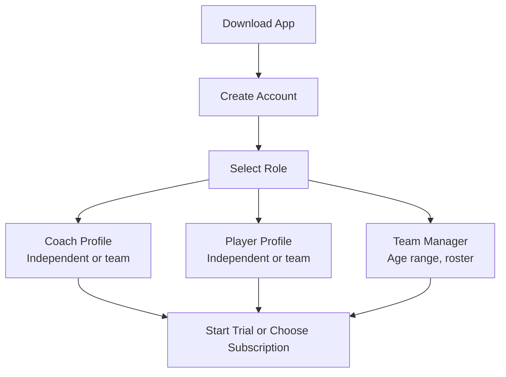
```mermaid
flowchart TD
    A[Download App] --> B[Create Account]
    B --> C[Select Role]
    C --> D[Coach Profile<br/>Independent or team]
    C --> E[Player Profile<br/>Independent or team]
    C --> F[Team Manager<br/>Age range, roster]
    D --> G[Start Trial or Choose Subscription]
    E --> G
    F --> G
```

_Coaches and players can operate independently without a team, or create/join teams later. Team managers must set up a team as part of their core workflow. Admin accounts are provisioned through the backend and do not appear in the self-registration flow._

### Flow 2: Subscription & Trial Flow

The trial-to-paid conversion funnel. Each tier builds on the one below.

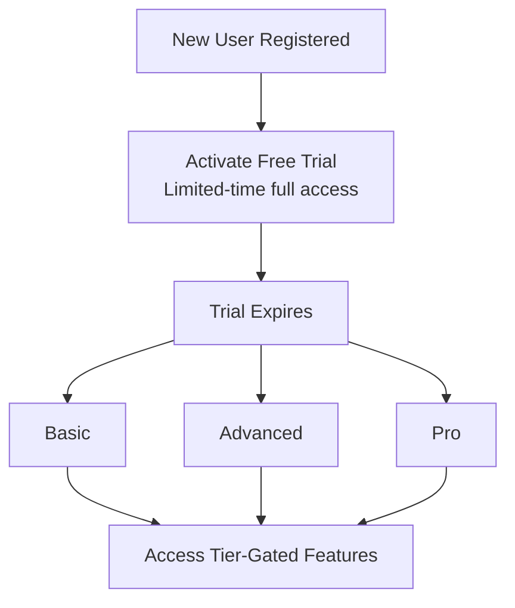
```mermaid
flowchart TD
    A[New User Registered] --> B[Activate Free Trial<br/>Limited-time full access]
    B --> C[Trial Expires]
    C --> D[Basic]
    C --> E[Advanced]
    C --> F[Pro]
    D --> G[Access Tier-Gated Features]
    E --> G
    F --> G
```

**Tier Feature Summary**

| Feature | Basic | Advanced | Pro |
| --- | --- | --- | --- |
| Profile setup | ✓ | ✓ | ✓ |
| Purchase content | ✓ | ✓ | ✓ |
| Track own progress | ✓ | ✓ | ✓ |
| Coach & communicate | — | ✓ | ✓ |
| Distribute content | — | ✓ | ✓ |
| Plan & schedule | — | ✓ | ✓ |
| AI personalization | — | — | ✓ |
| Set objectives | — | — | ✓ |
| Full MVP access | — | — | ✓ |

### Flow 3: Coach Planning & Scheduling

The session lifecycle from creation through content assignment to player notification.

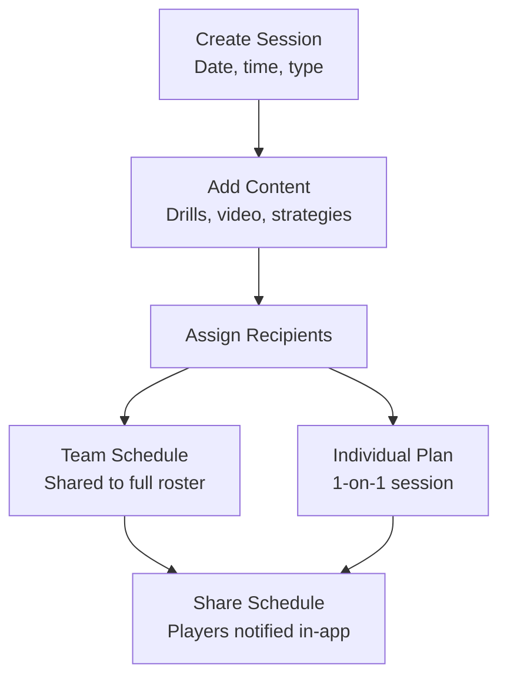
```mermaid
flowchart TD
    A[Create Session<br/>Date, time, type] --> B[Add Content<br/>Drills, video, strategies]
    B --> C[Assign Recipients]
    C --> D[Team Schedule<br/>Shared to full roster]
    C --> E[Individual Plan<br/>1-on-1 session]
    D --> F[Share Schedule<br/>Players notified in-app]
    E --> F
```

_Coaches can schedule for entire teams or create individual 1-on-1 sessions. All recipients receive in-app notifications._

### Flow 4: Marketplace & Content Dripping

Content commerce from browsing through AI recommendations, purchase, and gradual content release.

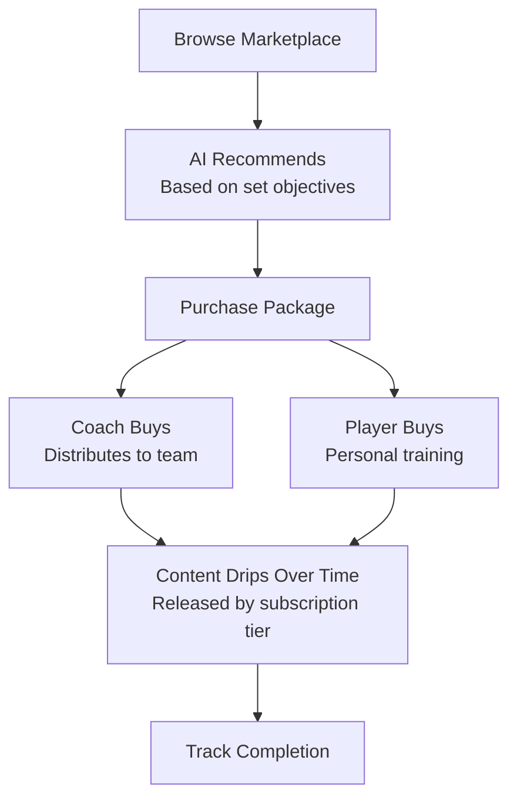
```mermaid
flowchart TD
    A[Browse Marketplace] --> B[AI Recommends<br/>Based on set objectives]
    B --> C[Purchase Package]
    C --> D[Coach Buys<br/>Distributes to team]
    C --> E[Player Buys<br/>Personal training]
    D --> F[Content Drips Over Time<br/>Released by subscription tier]
    E --> F
    F --> G[Track Completion]
```

_The dripping feature gradually releases content over a configured schedule. AI actively suggests packages matched to objectives._

### Flow 5: Chat & Communication

Three conversation types converging into real-time delivery with push notifications.

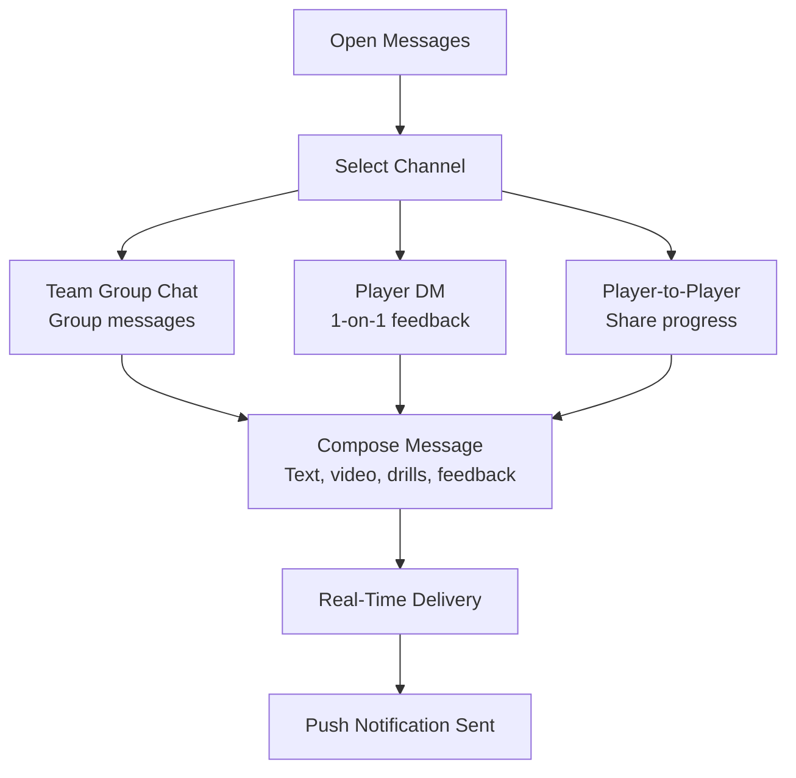
```mermaid
flowchart TD
    A[Open Messages] --> B[Select Channel]
    B --> C[Team Group Chat<br/>Group messages]
    B --> D[Player DM<br/>1-on-1 feedback]
    B --> E[Player-to-Player<br/>Share progress]
    C --> F[Compose Message<br/>Text, video, drills, feedback]
    D --> F
    E --> F
    F --> G[Real-Time Delivery]
    G --> H[Push Notification Sent]
```

### Flow 6: AI Engine & Objectives

The continuous feedback loop between objectives, AI monitoring, and personalized recommendations.

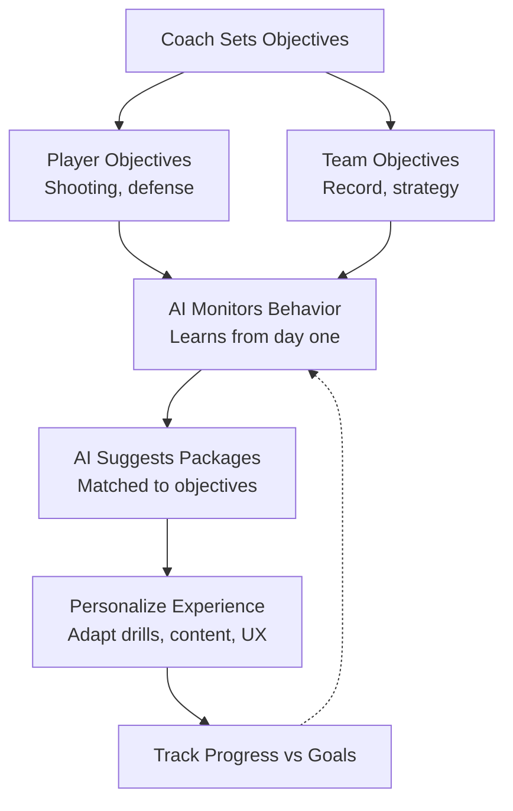
```mermaid
flowchart TD
    A[Coach Sets Objectives] --> B[Player Objectives<br/>Shooting, defense]
    A --> C[Team Objectives<br/>Record, strategy]
    B --> D[AI Monitors Behavior<br/>Learns from day one]
    C --> D
    D --> E[AI Suggests Packages<br/>Matched to objectives]
    E --> F[Personalize Experience<br/>Adapt drills, content, UX]
    F --> G[Track Progress vs Goals]
    G -.-> D
```

_Progress data feeds back into the AI engine, creating a continuous improvement loop that refines recommendations over time._

### Flow 7: Admin Interface

The admin control plane with four functional pillars. Admin accounts are created and configured exclusively through the backend — not through the app's self-registration flow.

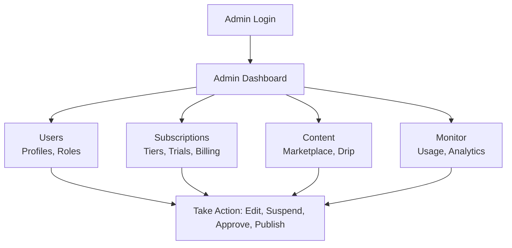
```mermaid
flowchart TD
    A[Admin Login] --> B[Admin Dashboard]
    B --> C[Users<br/>Profiles, Roles]
    B --> D[Subscriptions<br/>Tiers, Trials, Billing]
    B --> E[Content<br/>Marketplace, Drip]
    B --> F[Monitor<br/>Usage, Analytics]
    C --> G[Take Action: Edit, Suspend, Approve, Publish]
    D --> G
    E --> G
    F --> G
```

### Flow 8: Player Experience (End-to-End)

The complete player journey from receiving content to updating objective progress.

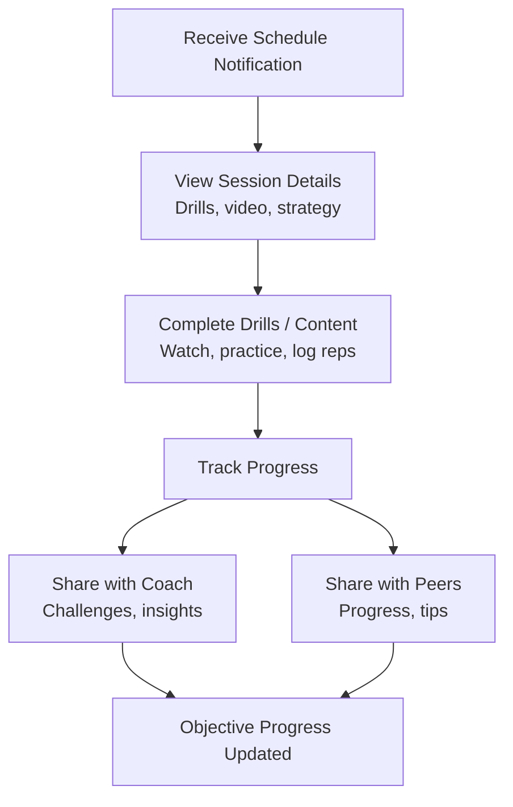
```mermaid
flowchart TD
    A[Receive Schedule Notification] --> B[View Session Details<br/>Drills, video, strategy]
    B --> C[Complete Drills / Content<br/>Watch, practice, log reps]
    C --> D[Track Progress]
    D --> E[Share with Coach<br/>Challenges, insights]
    D --> F[Share with Peers<br/>Progress, tips]
    E --> G[Objective Progress Updated]
    F --> G
```

---

## Part 2: Additional User Journeys

These flows cover secondary but essential user journeys including trial conversion, paywall encounters, team management, content workflows, feedback loops, and first-time user experiences.

### Flow 9: Trial Expiration & Conversion

What happens when a user's free trial period ends, including the conversion prompts and feature lockout experience.

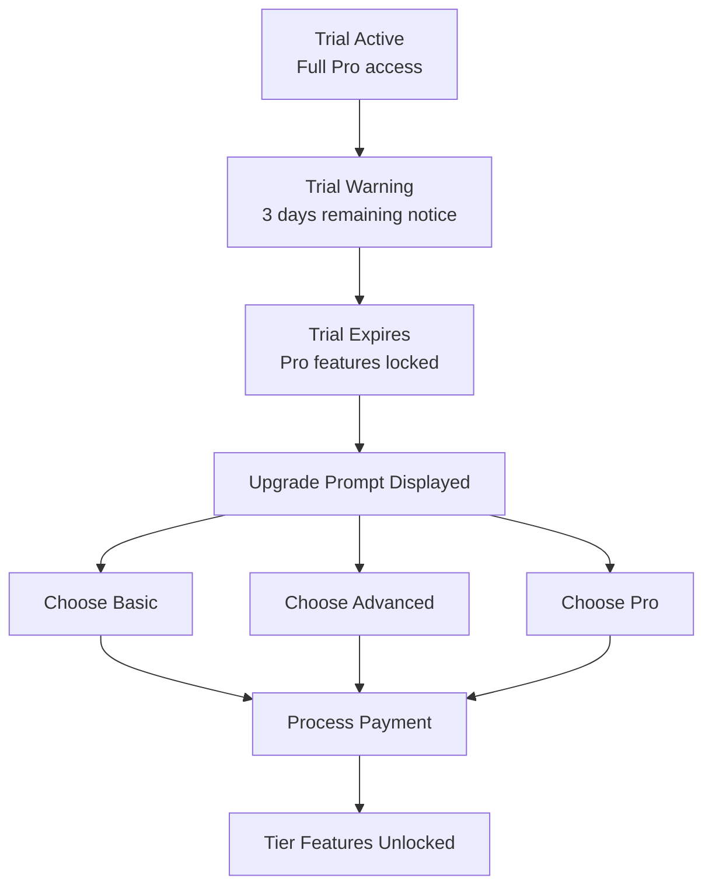
```mermaid
flowchart TD
    A[Trial Active<br/>Full Pro access] --> B[Trial Warning<br/>3 days remaining notice]
    B --> C[Trial Expires<br/>Pro features locked]
    C --> D[Upgrade Prompt Displayed]
    D --> E[Choose Basic]
    D --> F[Choose Advanced]
    D --> G[Choose Pro]
    E --> H[Process Payment]
    F --> H
    G --> H
    H --> I[Tier Features Unlocked]
```

_Users who do not subscribe after trial expiration retain a Basic-level profile but lose access to Advanced and Pro features. Purchased marketplace packages remain usable (OQ-9.3). They can upgrade at any time from account settings._

### Flow 10: Content Paywall Encounter

The experience when a user attempts to access a feature or content item gated behind a higher subscription tier.

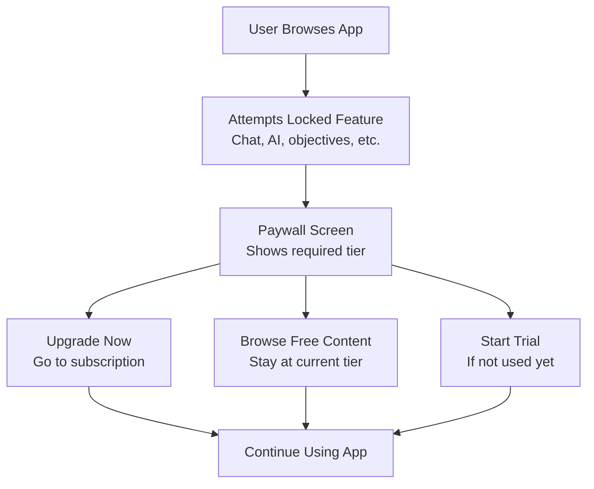
```mermaid
flowchart TD
    A[User Browses App] --> B[Attempts Locked Feature<br/>Chat, AI, objectives, etc.]
    B --> C[Paywall Screen<br/>Shows required tier]
    C --> D[Upgrade Now<br/>Go to subscription]
    C --> E[Browse Free Content<br/>Stay at current tier]
    C --> F[Start Trial<br/>If not used yet]
    D --> G[Continue Using App]
    E --> G
    F --> G
```

_The paywall screen clearly communicates which tier is required and what features it unlocks. Trial option is only shown if the user has not previously used their trial._

### Flow 11: Team Setup & Roster Management

How a coach or team manager creates a team, configures settings, and builds a roster. Team creation is optional for coaches and players — they can operate independently and create or join teams at any time.

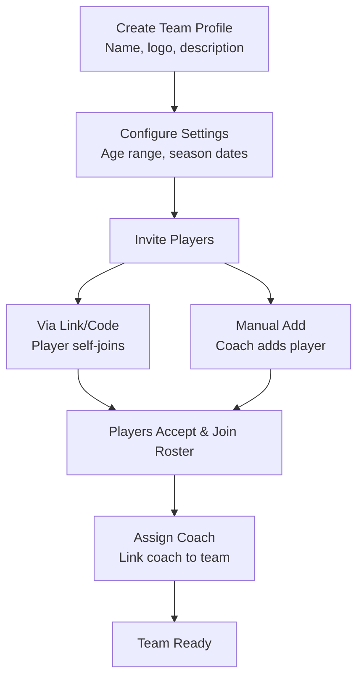
```mermaid
flowchart TD
    A[Create Team Profile<br/>Name, logo, description] --> B[Configure Settings<br/>Age range, season dates]
    B --> C[Invite Players]
    C --> D[Via Link/Code<br/>Player self-joins]
    C --> E[Manual Add<br/>Coach adds player]
    D --> F[Players Accept & Join Roster]
    E --> F
    F --> G[Assign Coach<br/>Link coach to team]
    G --> H[Team Ready]
```

_Players can be invited via a shareable link or code, or manually added by the coach. Team age ranges filter marketplace content recommendations._

### Flow 12: Coach Content Creation & Distribution

The full workflow for coaches creating, organizing, and distributing training content to players and teams.

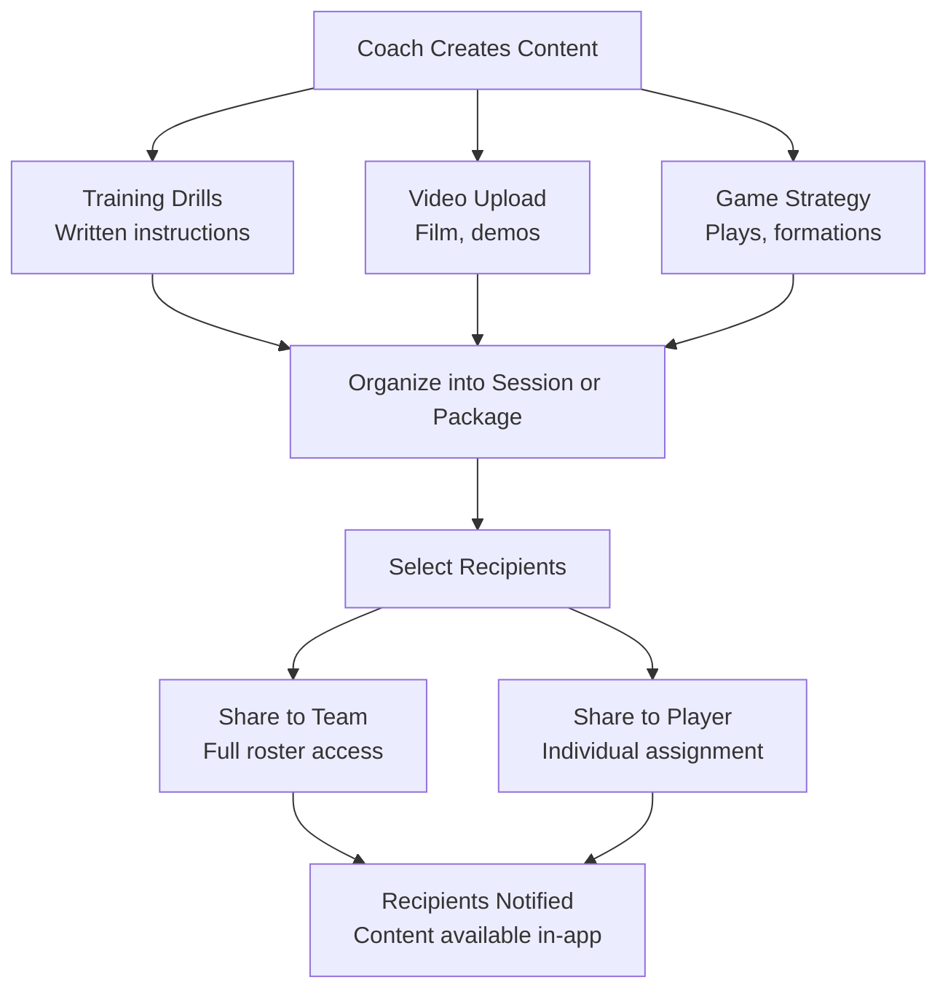
```mermaid
flowchart TD
    A[Coach Creates Content] --> B[Training Drills<br/>Written instructions]
    A --> C[Video Upload<br/>Film, demos]
    A --> D[Game Strategy<br/>Plays, formations]
    B --> E[Organize into Session or Package]
    C --> E
    D --> E
    E --> F[Select Recipients]
    F --> G[Share to Team<br/>Full roster access]
    F --> H[Share to Player<br/>Individual assignment]
    G --> I[Recipients Notified<br/>Content available in-app]
    H --> I
```

_Content can include video uploads, written drill instructions, and strategic playbooks. Coaches can bundle multiple items into a session or standalone package._

### Flow 13: Player Progress & Coach Feedback Loop

The cyclical feedback process between player performance tracking and coach evaluation.

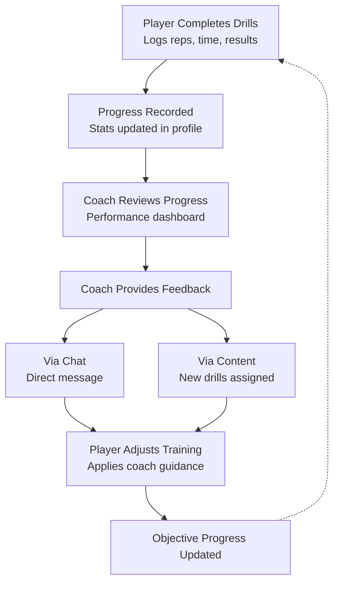
```mermaid
flowchart TD
    A[Player Completes Drills<br/>Logs reps, time, results] --> B[Progress Recorded<br/>Stats updated in profile]
    B --> C[Coach Reviews Progress<br/>Performance dashboard]
    C --> D[Coach Provides Feedback]
    D --> E[Via Chat<br/>Direct message]
    D --> F[Via Content<br/>New drills assigned]
    E --> G[Player Adjusts Training<br/>Applies coach guidance]
    F --> G
    G --> H[Objective Progress Updated]
    H -.-> A
```

_This creates a continuous improvement cycle. The AI engine also monitors this loop to refine its own recommendations for both coach and player._

### Flow 14: Drip Content Unlock Experience

How content is gradually released to users after purchasing a training package, and the notification and access flow.

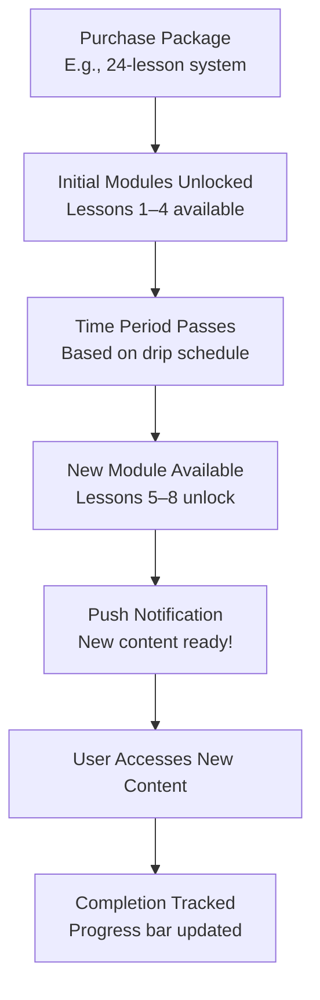
```mermaid
flowchart TD
    A[Purchase Package<br/>E.g., 24-lesson system] --> B[Initial Modules Unlocked<br/>Lessons 1–4 available]
    B --> C[Time Period Passes<br/>Based on drip schedule]
    C --> D[New Module Available<br/>Lessons 5–8 unlock]
    D --> E[Push Notification<br/>New content ready!]
    E --> F[User Accesses New Content]
    F --> G[Completion Tracked<br/>Progress bar updated]
```

_Drip schedules can vary by package (weekly, biweekly, etc.) and may release faster for higher subscription tiers. This prevents content overwhelm and encourages consistent engagement._

### Flow 15: First-Time Coach Onboarding

The guided experience for a coach logging in for the first time. Team creation is optional — coaches can work independently with individual players or create a team later.

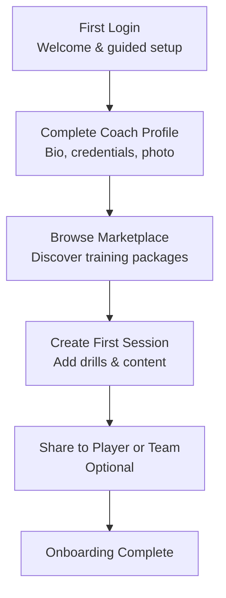
```mermaid
flowchart TD
    A[First Login<br/>Welcome & guided setup] --> B[Complete Coach Profile<br/>Bio, credentials, photo]
    B --> C[Browse Marketplace<br/>Discover training packages]
    C --> D[Create First Session<br/>Add drills & content]
    D --> E[Share to Player or Team<br/>Optional]
    E --> F[Onboarding Complete]
```

_The onboarding flow is guided with progress indicators. Team creation and player invites can be done later from the Roster screen. Coaches can immediately start creating sessions and content for individual players without a team._

### Flow 16: First-Time Player Onboarding

The guided experience for a player joining the platform for the first time. Joining a team is optional — players can train independently and join a team later via invite.

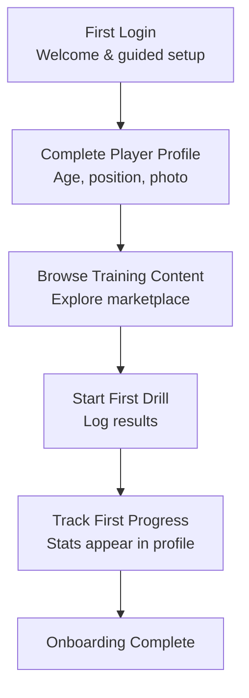
```mermaid
flowchart TD
    A[First Login<br/>Welcome & guided setup] --> B[Complete Player Profile<br/>Age, position, photo]
    B --> C[Browse Training Content<br/>Explore marketplace]
    C --> D[Start First Drill<br/>Log results]
    D --> E[Track First Progress<br/>Stats appear in profile]
    E --> F[Onboarding Complete]
```

_Players can join a team at any time via an invite link or code from their coach. Independent players have full access to the marketplace, personal training content, and progress tracking. Team features become available once they join a team._

### Flow 17: Subscription Upgrade & Downgrade

How users manage their subscription tier changes, including immediate upgrades and end-of-cycle downgrades.

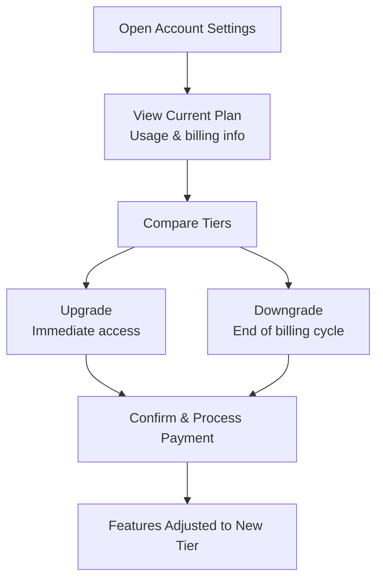
```mermaid
flowchart TD
    A[Open Account Settings] --> B[View Current Plan<br/>Usage & billing info]
    B --> C[Compare Tiers]
    C --> D[Upgrade<br/>Immediate access]
    C --> E[Downgrade<br/>End of billing cycle]
    D --> F[Confirm & Process Payment]
    E --> F
    F --> G[Features Adjusted to New Tier]
```

_Upgrades take effect immediately with prorated billing. Downgrades are applied at the end of the current billing cycle to ensure users retain paid access for the full period. Data from higher-tier features (e.g., objectives, AI history) is preserved but becomes inaccessible until re-upgrading. Purchased marketplace packages and coach-distributed content remain usable after downgrade (OQ-17.3); only subscription-gated features lock._

### Flow 18: Player-to-Player Knowledge Sharing

How players share progress, insights, and challenges with teammates, fostering peer learning and team engagement.

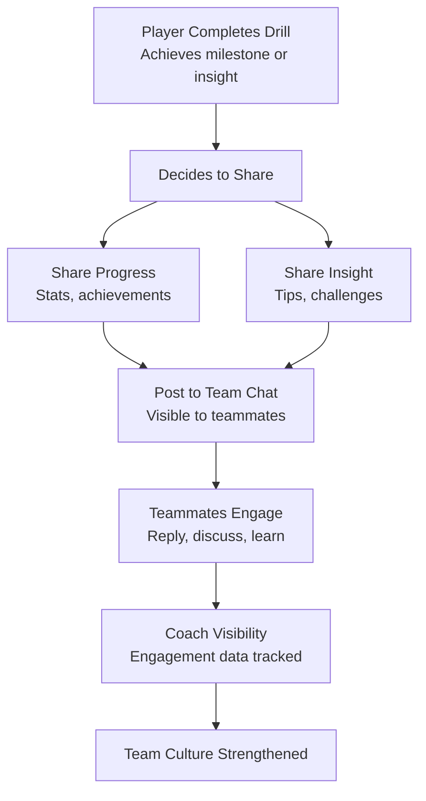
```mermaid
flowchart TD
    A[Player Completes Drill<br/>Achieves milestone or insight] --> B[Decides to Share]
    B --> C[Share Progress<br/>Stats, achievements]
    B --> D[Share Insight<br/>Tips, challenges]
    C --> E[Post to Team Chat<br/>Visible to teammates]
    D --> E
    E --> F[Teammates Engage<br/>Reply, discuss, learn]
    F --> G[Coach Visibility<br/>Engagement data tracked]
    G --> H[Team Culture Strengthened]
```

_Player-to-player sharing is available at Advanced tier and above. The AI engine monitors peer engagement patterns to identify team dynamics and suggest interventions to coaches._

---

## Part 3: Access Control Matrix

Feature-level access for each role across all four subscription tiers. The access control model combines role-based permissions with tier-based feature gating. This matrix reflects all 18 user journeys defined in Parts 1 and 2.

### Legend

| Symbol | Meaning |
| --- | --- |
| ✓ | Full access |
| ◎ | Read-only / limited access |
| ○ | Available at higher tier |
| ✗ | Not available for this role |

### Player Role Access

Player access is consumption-focused. Basic players can set up a profile and purchase content. Communication and peer sharing unlock at Advanced. AI features, objectives, and the full performance dashboard require Pro.

| Feature | Trial | Basic | Advanced | Pro |
| --- | --- | --- | --- | --- |
| **Onboarding & Setup (Flows 1, 16)** | | | | |
| Guided onboarding wizard | ✓ | ✓ | ✓ | ✓ |
| Create player profile | ✓ | ✓ | ✓ | ✓ |
| Edit own profile | ✓ | ✓ | ✓ | ✓ |
| Join team via invite link or code (optional) | ✓ | ✓ | ✓ | ✓ |
| View first schedule after joining | ✓ | ✓ | ✓ | ✓ |
| Complete first drill (onboarding) | ✓ | ✓ | ✓ | ✓ |
| **Trial & Subscription Management (Flows 2, 9, 10, 17)** | | | | |
| Activate free trial | ✓ | ✗ | ✗ | ✗ |
| View trial status & countdown | ✓ | ✗ | ✗ | ✗ |
| Receive trial expiration warnings | ✓ | ✗ | ✗ | ✗ |
| View current plan details | ✓ | ✓ | ✓ | ✓ |
| Compare subscription tiers | ✓ | ✓ | ✓ | ✓ |
| Upgrade subscription | ✓ | ✓ | ✓ | ✓ |
| Downgrade subscription | ✗ | ✓ | ✓ | ✓ |
| View billing history | ✗ | ✓ | ✓ | ✓ |
| **Content Paywall (Flow 10)** | | | | |
| View paywall prompts on locked features | ✓ | ✓ | ✓ | ✓ |
| Access upgrade flow from paywall | ✓ | ✓ | ✓ | ✓ |
| Browse free content alternatives | ✓ | ✓ | ✓ | ✓ |
| **Content & Marketplace (Flows 4, 14)** | | | | |
| Browse marketplace | ◎ | ✓ | ✓ | ✓ |
| Purchase content (personal) | ✗ | ✓ | ✓ | ✓ |
| Access dripped content | ✗ | ✓ | ✓ | ✓ |
| View drip schedule & unlock timeline | ✗ | ✓ | ✓ | ✓ |
| Receive content unlock notifications | ✗ | ✓ | ✓ | ✓ |
| View training materials | ✗ | ◎ | ✓ | ✓ |
| Watch shared video | ✗ | ◎ | ✓ | ✓ |
| View content completion progress | ✗ | ✓ | ✓ | ✓ |
| **Planning & Scheduling (Flow 8)** | | | | |
| Receive schedule notifications | ✗ | ✓ | ✓ | ✓ |
| View shared schedule | ✗ | ✓ | ✓ | ✓ |
| View session details (drills, video) | ✗ | ✓ | ✓ | ✓ |
| Create practice sessions | ✗ | ✗ | ✗ | ✗ |
| Share schedule to team | ✗ | ✗ | ✗ | ✗ |
| **Communication (Flows 5, 18)** | | | | |
| Team group chat | ✗ | ✗ | ✓ | ✓ |
| Direct message coach | ✗ | ✗ | ✓ | ✓ |
| Message other players | ✗ | ✗ | ✓ | ✓ |
| Share progress with coach | ✗ | ✗ | ✓ | ✓ |
| Share insights with teammates | ✗ | ✗ | ✓ | ✓ |
| **Peer Knowledge Sharing (Flow 18)** | | | | |
| Share achievements to team chat | ✗ | ✗ | ✓ | ✓ |
| Share tips & challenges | ✗ | ✗ | ✓ | ✓ |
| View peer shared content | ✗ | ✗ | ✓ | ✓ |
| Engage in peer discussions | ✗ | ✗ | ✓ | ✓ |
| **Objectives & Progress Tracking (Flows 6, 8, 13)** | | | | |
| Log drill completions & reps | ✗ | ✓ | ✓ | ✓ |
| Track own progress | ✗ | ◎ | ○ | ✓ |
| View own objectives | ✗ | ✗ | ○ | ✓ |
| View progress dashboard | ✗ | ◎ | ○ | ✓ |
| Set objectives | ✗ | ✗ | ✗ | ✗ |
| Receive coach feedback | ✗ | ✗ | ✓ | ✓ |
| Adjust training based on feedback | ✗ | ✗ | ✓ | ✓ |
| **AI Features (Flow 6)** | | | | |
| AI-personalized experience | ✗ | ✗ | ○ | ✓ |
| AI package suggestions | ✗ | ✗ | ○ | ✓ |
| Behavior-based learning | ✗ | ✗ | ○ | ✓ |
| Manage users | ✗ | ✗ | ✗ | ✗ |
| Manage subscriptions | ✗ | ✗ | ✗ | ✗ |
| Manage marketplace | ✗ | ✗ | ✗ | ✗ |
| View platform analytics | ✗ | ✗ | ✗ | ✗ |

### Coach Role Access

Coach access is creation-focused. The full coaching toolkit — planning, scheduling, content creation, distribution, and chat — unlocks at Advanced. Objectives, the performance dashboard, drip configuration, and AI insights are gated behind Pro.

| Feature | Trial | Basic | Advanced | Pro |
| --- | --- | --- | --- | --- |
| **Onboarding & Setup (Flows 1, 15)** | | | | |
| Guided onboarding wizard | ✓ | ✓ | ✓ | ✓ |
| Create coach profile | ✓ | ✓ | ✓ | ✓ |
| Edit own profile | ✓ | ✓ | ✓ | ✓ |
| Create first team during onboarding (optional) | ✓ | ✓ | ✓ | ✓ |
| Invite players during onboarding | ✓ | ✓ | ✓ | ✓ |
| Browse marketplace during onboarding | ✓ | ✓ | ✓ | ✓ |
| **Trial & Subscription Management (Flows 2, 9, 10, 17)** | | | | |
| Activate free trial | ✓ | ✗ | ✗ | ✗ |
| View trial status & countdown | ✓ | ✗ | ✗ | ✗ |
| Receive trial expiration warnings | ✓ | ✗ | ✗ | ✗ |
| View current plan details | ✓ | ✓ | ✓ | ✓ |
| Compare subscription tiers | ✓ | ✓ | ✓ | ✓ |
| Upgrade subscription | ✓ | ✓ | ✓ | ✓ |
| Downgrade subscription | ✗ | ✓ | ✓ | ✓ |
| View billing history | ✗ | ✓ | ✓ | ✓ |
| **Content Paywall (Flow 10)** | | | | |
| View paywall prompts on locked features | ✓ | ✓ | ✓ | ✓ |
| Access upgrade flow from paywall | ✓ | ✓ | ✓ | ✓ |
| **Team Management (Flow 11)** | | | | |
| Create team | ✗ | ✓ | ✓ | ✓ |
| Configure team settings (age range, season) | ✗ | ✓ | ✓ | ✓ |
| Invite players via link or code | ✗ | ✗ | ✓ | ✓ |
| Manually add players to roster | ✗ | ✗ | ✓ | ✓ |
| Remove players from roster | ✗ | ✗ | ✓ | ✓ |
| Assign coaches to team | ✗ | ✗ | ○ | ✓ |
| View and manage team rosters | ✗ | ◎ | ✓ | ✓ |
| **Content Creation & Distribution (Flow 12)** | | | | |
| Create training drills | ✗ | ✗ | ✓ | ✓ |
| Upload video content | ✗ | ✗ | ✓ | ✓ |
| Create game strategies & playbooks | ✗ | ✗ | ✓ | ✓ |
| Organize content into sessions | ✗ | ✗ | ✓ | ✓ |
| Distribute content to team | ✗ | ✗ | ✓ | ✓ |
| Distribute content to individual player | ✗ | ✗ | ✓ | ✓ |
| **Content & Marketplace (Flows 4, 14)** | | | | |
| Browse marketplace | ◎ | ✓ | ✓ | ✓ |
| Purchase content (personal) | ✗ | ✓ | ✓ | ✓ |
| Purchase & distribute to players | ✗ | ✗ | ✓ | ✓ |
| Configure drip schedules | ✗ | ✗ | ○ | ✓ |
| View content completion by player | ✗ | ✗ | ✓ | ✓ |
| **Planning & Scheduling (Flow 3)** | | | | |
| Create practice sessions | ✗ | ✗ | ✓ | ✓ |
| Add drills & content to sessions | ✗ | ✗ | ✓ | ✓ |
| Share schedule to team | ✗ | ✗ | ✓ | ✓ |
| Schedule individual 1-on-1 sessions | ✗ | ✗ | ✓ | ✓ |
| **Communication (Flow 5)** | | | | |
| Team group chat | ✗ | ✗ | ✓ | ✓ |
| Direct message players | ✗ | ✗ | ✓ | ✓ |
| Receive player progress shares | ✗ | ✗ | ✓ | ✓ |
| View player peer engagement | ✗ | ✗ | ○ | ✓ |
| **Player Feedback Loop (Flow 13)** | | | | |
| View player progress dashboard | ✗ | ✗ | ✓ | ✓ |
| Review player drill completions | ✗ | ✗ | ✓ | ✓ |
| Provide feedback via chat | ✗ | ✗ | ✓ | ✓ |
| Assign corrective drills based on review | ✗ | ✗ | ✓ | ✓ |
| AI-driven player performance insights | ✗ | ✗ | ○ | ✓ |
| **Objectives & Tracking (Flow 6)** | | | | |
| Set player objectives | ✗ | ✗ | ○ | ✓ |
| Set team objectives | ✗ | ✗ | ○ | ✓ |
| Track player progress vs objectives | ✗ | ◎ | ✓ | ✓ |
| Review player performance trends | ✗ | ✗ | ○ | ✓ |
| **AI Features (Flow 6)** | | | | |
| AI-personalized experience | ✗ | ✗ | ○ | ✓ |
| AI package suggestions | ✗ | ✗ | ○ | ✓ |
| AI-driven player insights | ✗ | ✗ | ○ | ✓ |
| Behavior-based learning | ✗ | ✗ | ○ | ✓ |
| Manage users | ✗ | ✗ | ✗ | ✗ |
| Manage subscriptions | ✗ | ✗ | ✗ | ✗ |
| Manage marketplace | ✗ | ✗ | ✗ | ✗ |
| View platform analytics | ✗ | ✗ | ✗ | ✗ |

### Team Manager Role Access

Team manager access is scoped to team-level operations — roster management, team schedules, broadcasting, and team-level content distribution. Individual player interactions require a coach role.

| Feature | Trial | Basic | Advanced | Pro |
| --- | --- | --- | --- | --- |
| **Onboarding & Setup (Flows 1, 11)** | | | | |
| Guided onboarding wizard | ✓ | ✓ | ✓ | ✓ |
| Create team profile | ✓ | ✓ | ✓ | ✓ |
| Edit team profile | ✓ | ✓ | ✓ | ✓ |
| Set team age range | ✓ | ✓ | ✓ | ✓ |
| **Trial & Subscription Management (Flows 2, 9, 17)** | | | | |
| Activate free trial | ✓ | ✗ | ✗ | ✗ |
| View trial status & countdown | ✓ | ✗ | ✗ | ✗ |
| View current plan details | ✓ | ✓ | ✓ | ✓ |
| Compare subscription tiers | ✓ | ✓ | ✓ | ✓ |
| Upgrade subscription | ✓ | ✓ | ✓ | ✓ |
| Downgrade subscription | ✗ | ✓ | ✓ | ✓ |
| **Content Paywall (Flow 10)** | | | | |
| View paywall prompts on locked features | ✓ | ✓ | ✓ | ✓ |
| Access upgrade flow from paywall | ✓ | ✓ | ✓ | ✓ |
| **Team Management (Flow 11)** | | | | |
| Invite players via link or code | ✗ | ✓ | ✓ | ✓ |
| Manually add players to roster | ✗ | ✓ | ✓ | ✓ |
| Remove players from roster | ✗ | ✓ | ✓ | ✓ |
| Manage full roster | ✗ | ✓ | ✓ | ✓ |
| Assign coach to team | ✗ | ✗ | ✓ | ✓ |
| **Content & Marketplace (Flows 4, 14)** | | | | |
| Browse marketplace | ◎ | ✓ | ✓ | ✓ |
| Purchase team packages | ✗ | ✓ | ✓ | ✓ |
| Access dripped content | ✗ | ✓ | ✓ | ✓ |
| Distribute content to roster | ✗ | ✗ | ✓ | ✓ |
| View drip schedule & unlock timeline | ✗ | ✓ | ✓ | ✓ |
| **Planning & Scheduling (Flow 3)** | | | | |
| View team schedule | ✗ | ✓ | ✓ | ✓ |
| Create team sessions | ✗ | ✗ | ✓ | ✓ |
| Assign sessions to roster | ✗ | ✗ | ✓ | ✓ |
| **Communication (Flow 5)** | | | | |
| Team group chat | ✗ | ✗ | ✓ | ✓ |
| Broadcast announcements | ✗ | ✗ | ✓ | ✓ |
| **Objectives & Tracking (Flow 6)** | | | | |
| Set team objectives | ✗ | ✗ | ○ | ✓ |
| Track team progress | ✗ | ◎ | ✓ | ✓ |
| View team completion stats | ✗ | ◎ | ✓ | ✓ |
| **AI Features (Flow 6)** | | | | |
| AI package suggestions for team | ✗ | ✗ | ○ | ✓ |
| Team behavior insights | ✗ | ✗ | ○ | ✓ |
| Manage users | ✗ | ✗ | ✗ | ✗ |
| Manage subscriptions | ✗ | ✗ | ✗ | ✗ |
| Manage marketplace | ✗ | ✗ | ✗ | ✗ |
| View platform analytics | ✗ | ✗ | ✗ | ✗ |

### Admin Role Access

Admin has full access to all features regardless of subscription tier. Permissions span user management, subscription configuration, marketplace curation, onboarding configuration, chat moderation, AI configuration, and platform analytics.

| Feature | Trial | Basic | Advanced | Pro |
| --- | --- | --- | --- | --- |
| **User & Profile Management (Flows 1, 7)** | | | | |
| View all user profiles | ✓ | ✓ | ✓ | ✓ |
| Edit any user profile | ✓ | ✓ | ✓ | ✓ |
| Suspend or deactivate users | ✓ | ✓ | ✓ | ✓ |
| Assign or change user roles | ✓ | ✓ | ✓ | ✓ |
| View all team rosters | ✓ | ✓ | ✓ | ✓ |
| **Onboarding Configuration (Flows 15, 16)** | | | | |
| Configure onboarding wizard steps | ✓ | ✓ | ✓ | ✓ |
| Customize welcome messaging | ✓ | ✓ | ✓ | ✓ |
| Set mandatory vs optional setup steps | ✓ | ✓ | ✓ | ✓ |
| View onboarding completion analytics | ✓ | ✓ | ✓ | ✓ |
| **Subscription & Trial Management (Flows 2, 9, 17)** | | | | |
| Configure subscription tiers | ✓ | ✓ | ✓ | ✓ |
| Set trial duration & parameters | ✓ | ✓ | ✓ | ✓ |
| Configure trial expiration warnings | ✓ | ✓ | ✓ | ✓ |
| Manage upgrade/downgrade policies | ✓ | ✓ | ✓ | ✓ |
| View billing and revenue | ✓ | ✓ | ✓ | ✓ |
| Override user subscriptions | ✓ | ✓ | ✓ | ✓ |
| Set feature gating per tier | ✓ | ✓ | ✓ | ✓ |
| **Content Paywall Configuration (Flow 10)** | | | | |
| Configure paywall messaging | ✓ | ✓ | ✓ | ✓ |
| Set tier requirements per feature | ✓ | ✓ | ✓ | ✓ |
| Define free content catalog | ✓ | ✓ | ✓ | ✓ |
| **Content & Marketplace Management (Flows 4, 12, 14)** | | | | |
| Manage marketplace catalog | ✓ | ✓ | ✓ | ✓ |
| Publish and unpublish packages | ✓ | ✓ | ✓ | ✓ |
| Configure pricing | ✓ | ✓ | ✓ | ✓ |
| Set drip schedules globally | ✓ | ✓ | ✓ | ✓ |
| Review and approve coach-created content | ✓ | ✓ | ✓ | ✓ |
| Configure drip timing per tier | ✓ | ✓ | ✓ | ✓ |
| **Team Oversight (Flow 11)** | | | | |
| View all teams | ✓ | ✓ | ✓ | ✓ |
| Edit team settings | ✓ | ✓ | ✓ | ✓ |
| Manage coach-team assignments | ✓ | ✓ | ✓ | ✓ |
| Deactivate or archive teams | ✓ | ✓ | ✓ | ✓ |
| **Communication & Moderation (Flows 5, 18)** | | | | |
| Monitor all chat channels | ✓ | ✓ | ✓ | ✓ |
| Moderate content & messages | ✓ | ✓ | ✓ | ✓ |
| Send system announcements | ✓ | ✓ | ✓ | ✓ |
| View peer sharing engagement metrics | ✓ | ✓ | ✓ | ✓ |
| **Feedback & Performance Oversight (Flow 13)** | | | | |
| View coach-player feedback activity | ✓ | ✓ | ✓ | ✓ |
| Monitor progress tracking usage | ✓ | ✓ | ✓ | ✓ |
| Review feedback loop analytics | ✓ | ✓ | ✓ | ✓ |
| **AI & System (Flow 6)** | | | | |
| Configure AI parameters | ✓ | ✓ | ✓ | ✓ |
| Review AI recommendations quality | ✓ | ✓ | ✓ | ✓ |
| View platform analytics | ✓ | ✓ | ✓ | ✓ |
| Monitor app health | ✓ | ✓ | ✓ | ✓ |
| Export reports | ✓ | ✓ | ✓ | ✓ |

---

## Access Control Design Principles

- Each tier builds on the one below it — upgrading never removes access to previously available features.
- Role determines which features are relevant; tier determines which of those features are unlocked.
- Coaches and players can operate independently without a team. Team creation and joining are optional and can be done at any point after onboarding.
- Only Coach, Player, and Team Manager roles are available through self-registration. Admin accounts are provisioned exclusively via the backend.
- Admin access is tier-independent — full access to all platform management capabilities at every level.
- The free trial provides time-limited Pro-level access so users experience the full product before selecting a tier.
- AI features are exclusively available at the Pro tier, creating a clear value differentiator for the highest subscription.
- Downgrades preserve data from higher-tier features but make them inaccessible until re-upgrading.
- Content paywall prompts show the specific tier required and available upgrade paths without blocking navigation.
- Onboarding flows are accessible at all tiers, ensuring every new user has a guided first experience regardless of subscription level.
- Peer knowledge sharing is gated at Advanced to encourage social engagement as a mid-tier value proposition.
- The coach feedback loop requires Advanced for basic chat feedback, and Pro for the full performance dashboard and AI-driven insights.
- Team management actions (inviting, removing players) are available to coaches at Advanced+ and team managers at Basic+, reflecting their different primary responsibilities.
- Independent coaches can create sessions and share content with individual players without needing a team structure.
- Independent players have full access to the marketplace, personal training, and progress tracking without being on a team.
